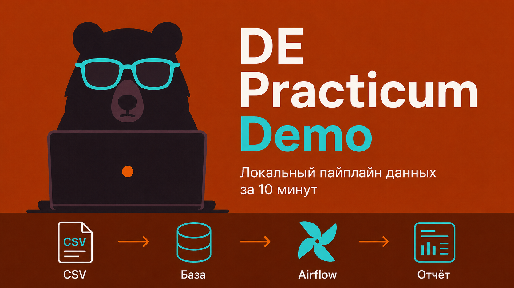
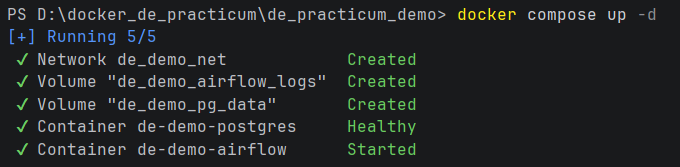
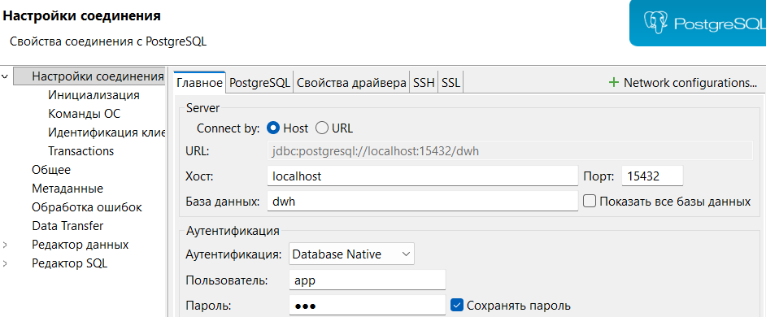
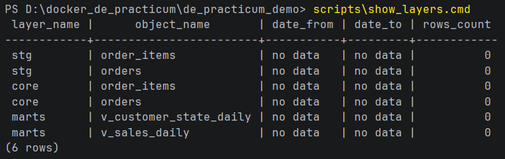
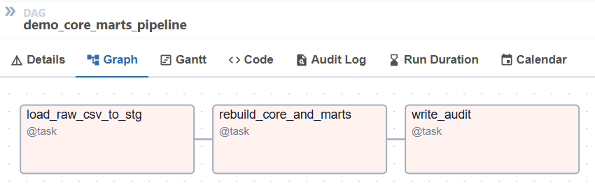
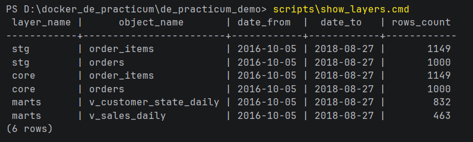
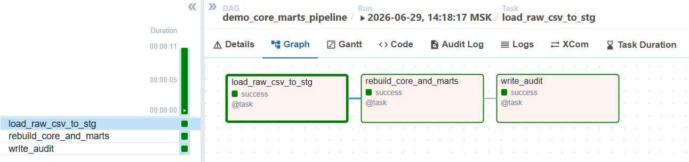

Это открытое demo облегченной версии стенда.  
Полная программа практикума: https://kuzmin-dmitry.ru/de_practicum

Локальный demo-стенд курса без Spark, MinIO и Jupyter. Внутри только Postgres, Airflow, 4 CSV-файла и короткий путь: `data/raw` -> `stg` -> `core` -> `marts` -> проверки -> HTML-отчет.

Быстрый старт:

- Windows: [docs/quickstart_windows.md](docs/quickstart_windows.md)
- macOS/Linux: [docs/quickstart_macos_linux.md](docs/quickstart_macos_linux.md)

## Что ты поймешь после demo

Это не упражнение “написать один select”. Смысл demo в том, чтобы руками пройти маленький DE-процесс:

- как CSV-файлы попадают в `stg`
- зачем нужен отдельный `core`-слой
- чем витрина `marts` отличается от сырой таблицы
- где появляются grain checks, null-key checks и reconcile
- зачем нужен Airflow, если SQL уже умеет считать данные
- почему витрина без проверки качества опасна
- как выглядит маленький, но настоящий data engineering pipeline

Короткая схема лежит в [docs/schema.md](docs/schema.md).

## Три маршрута

Не обязательно проходить все сразу.

**Маршрут 1. Запустить pipeline и посмотреть слои**

Подними стенд, запусти DAG, проверь, что данные прошли путь `CSV -> stg -> core -> marts`. Это основной сценарий demo.

**Маршрут 2. SQL-задача**

Добавь новую витрину `marts.v_payment_type_daily`. Это маршрут для тех, кто уже знает SQL и хочет увидеть, чем витрина отличается от разового запроса.

**Маршрут 3. Airflow-задача**

Добавь quality gate в DAG. Это маршрут на рост: чуть Python, чуть Airflow, реальная проверка перед audit.

Задания лежат в [docs/exercises.md](docs/exercises.md).

## Пререквизиты

Минимум:

- Docker Desktop
- Git

Удобно дополнительно:

- VS Code или PyCharm
- DBeaver для просмотра Postgres

Справка по Docker Desktop: [docs/docker_desktop_windows.md](docs/docker_desktop_windows.md).

Настройки по умолчанию уже зашиты в `docker-compose.yml`. Если хочешь переопределить пользователя, пароль или timezone, скопируй `.env.example` в `.env` и измени значения.

## Быстрая диагностика

Перед запуском можно проверить окружение:

Windows:

```powershell
scripts\doctor.cmd
```

macOS/Linux:

```bash
bash scripts/doctor.sh
```

Doctor проверяет, что ты в корне проекта, Docker отвечает, Compose доступен, CSV-файлы на месте, а порты `15432` и `18085` не заняты чужими процессами.

## Запуск

Обычный вариант:

```powershell
docker compose up -d
```



Если Docker Hub отдает `EOF` при скачивании `apache/airflow`, но на машине уже есть совместимый локальный образ Airflow:

```powershell
docker compose -f docker-compose.local-airflow.yml up -d
```

Это запасной локальный вариант. Для обычного запуска основной командой остается `docker compose up -d`.

Airflow: http://localhost:18085

Логин: `admin`

Пароль: `admin`

Желтые предупреждения Airflow про SQLite metadata DB и SequentialExecutor нормальны для этого demo. Это не production-настройка, а упрощение, чтобы стенд запускался локально в 2 контейнерах.

Postgres для DBeaver или psql:

- host: `localhost`
- port: `15432`
- database: `dwh`
- user: `app`
- password: `app`



## Маршрут 1. Pipeline

До запуска DAG в Postgres уже есть схемы и объекты, но данных еще нет.

Windows:

```powershell
scripts\show_layers.cmd
```

macOS/Linux:

```bash
bash scripts/show_layers.sh
```

Ожидаемо увидишь `rows_count = 0` и `no data` по слоям.



Дальше:

1. Открой Airflow.
2. Найди DAG `demo_core_marts_pipeline`.
3. Включи DAG переключателем.
4. Нажми Trigger DAG.
5. Дождись успешного run.



Проверки после DAG:

Windows:

```powershell
scripts\run_checks.cmd
```

macOS/Linux:

```bash
bash scripts/run_checks.sh
```



После DAG данные появятся в слоях:

- `stg.orders`, `stg.order_items`, `stg.order_payments`, `stg.customers`
- `core.orders`, `core.order_items`
- `marts.v_sales_daily`, `marts.v_customer_state_daily`, `marts.v_order_items_wide`



Smoke-проверка должна показать `status = success`, `duplicate_grain_rows = 0`, `null_key_rows = 0`, `max_reconcile_diff = 0.00`.

## Отчет

После успешного DAG можно собрать HTML-отчет.

Windows:

```powershell
scripts\build_report.cmd
```

macOS/Linux:

```bash
bash scripts/build_report.sh
```

Открой файл:

```text
reports/demo_quality_report.html
```

Отчет показывает слои загрузки, quality scorecard, grain/null-key проверки, reconcile и smoke последнего запуска.

## Маршрут 2 и 3. Задания руками

После базового demo можно сделать два маленьких задания:

- SQL: добавить витрину `marts.v_payment_type_daily`
- Airflow: добавить quality gate `check_payment_reconcile`

Инструкция: [docs/exercises.md](docs/exercises.md).

Проверки для Windows:

```powershell
scripts\check_task_sql.cmd
scripts\check_task_airflow.cmd
```

Проверки для macOS/Linux:

```bash
bash scripts/check_task_sql.sh
bash scripts/check_task_airflow.sh
```

## Если застрял

Сначала запусти doctor:

```text
scripts\doctor.cmd
bash scripts/doctor.sh
```

Если проблема осталась, создай issue в репозитории или пришли диагностику:

```text
docker compose ps
docker compose logs --tail=100 de-demo-postgres
docker compose logs --tail=100 de-demo-airflow
scripts\doctor.cmd
scripts\run_checks.cmd
```

Для macOS/Linux замени `.cmd` на `.sh`.

## Что дальше

Если demo зашло и хочешь пройти полный путь с Docker, Airflow, Postgres, MinIO, Spark и витринами данных, посмотри полную программу практикума:

https://kuzmin-dmitry.ru/de_practicum

## Справка

- [docs/quickstart_windows.md](docs/quickstart_windows.md)
- [docs/quickstart_macos_linux.md](docs/quickstart_macos_linux.md)
- [docs/schema.md](docs/schema.md)
- [docs/exercises.md](docs/exercises.md)
- [docs/docker_desktop_windows.md](docs/docker_desktop_windows.md)
- [docs/troubleshooting.md](docs/troubleshooting.md)

## Остановка

```powershell
docker compose down
```

Полная очистка данных:

```powershell
docker compose down -v
```
