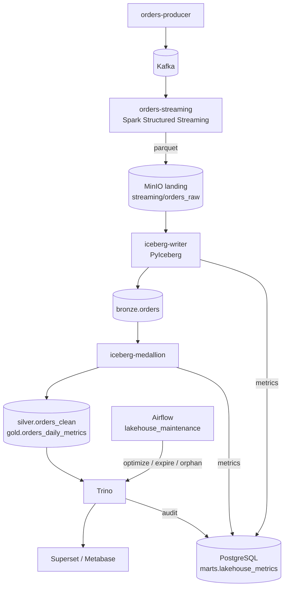
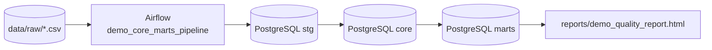

<!-- generated-by: gsd-doc-writer -->
# Architecture

## System overview

The Local Data Engineering Platform is a Docker Compose-based educational lakehouse and data warehouse that runs entirely on one host. It takes two kinds of input — a Kafka event stream and CSV files — and produces analytics-ready data in an Iceberg lakehouse (queried through Trino) and in a PostgreSQL warehouse (surfaced through Metabase). The design is layered: ingestion and staging, an Iceberg bronze/silver/gold medallion, and BI consumption. Both pipelines share MinIO as S3-compatible object storage and the Iceberg REST catalog as the metadata layer.

## Component diagram

### Real-time orders pipeline

### Batch Olist pipeline

## Data flow

### Real-time flow

1. `orders-producer` (`kafka/producer/orders_producer.py`) generates JSON order events and publishes them to the `orders` Kafka topic at a configurable rate (2 events/second by default).
2. `orders-streaming` runs `spark/jobs/orders_streaming.py`, a Spark Structured Streaming job that consumes the topic with a 10-second processing trigger. It produces two outputs:
   - Parquet files written to `s3://de-practicum/streaming/orders_raw` (the landing bucket), partitioned by `event_date`, with checkpoints in `s3://de-practicum/checkpoints/orders_raw`.
   - An upsert into `marts.streaming_orders` in PostgreSQL (checkpoints in `s3://de-practicum/checkpoints/orders_postgres`).
3. `iceberg-writer` runs `iceberg/writer/iceberg_writer.py`, polling the landing bucket every 10 seconds. Settled Parquet files are appended into `bronze.orders` in the Iceberg catalog (partitioned by day), one snapshot per batch. Each append carries a `load-id` in the snapshot summary for idempotency.
4. `iceberg-medallion` runs `iceberg/medallion/iceberg_medallion.py` every 60 seconds. It runs quality assertions on the bronze batch (`order_id`, `amount`, `country`, `status`, `event_time`), overwrites `silver.orders_clean` (deduplicated by `order_id`, highest `kafka_offset` wins) and then `gold.orders_daily_metrics` (aggregates per `event_date` / `country` / `status`).
5. Trino reads the Iceberg tables through the REST catalog for SQL analytics, and Superset / Metabase provide dashboards.
6. Every writer batch and medallion cycle writes one observability row to `marts.lakehouse_metrics` in PostgreSQL (`iceberg/common/ops.py`), covering rows/files per batch, row counts per layer, duplicates removed, quality violations, and duration. B2 cycles also record affected-key scan files/bytes and the data files/bytes and snapshot delta produced by the Silver overwrite.
7. Airflow DAG `lakehouse_maintenance` (`dags/lakehouse_maintenance.py`) runs hourly (and on manual trigger): it invokes Trino's `ALTER TABLE ... EXECUTE` table procedures (`optimize`, `expire_snapshots`, `remove_orphan_files`) on `bronze.orders`, `silver.orders_clean`, and `gold.orders_daily_metrics`, then records before/after snapshot counts into `marts.maintenance_runs`.

The same streaming job also upserts every micro-batch into PostgreSQL `marts.streaming_orders`; this is the second output of the Spark query and is independent of the Iceberg path. It is an independently derived low-latency serving/cache surface, not the authoritative current-state domain projection. Its upsert is monotonic on `business_version`: late or equal-version observations cannot replace a newer row. Authoritative current-state semantics remain owned by the PyIceberg medallion path.

### Batch flow

1. Raw Olist CSV files in `data/raw/` are loaded by the Airflow DAG `demo_core_marts_pipeline` (`dags/demo_core_marts_pipeline.py`).
2. The DAG truncates and loads the `stg` staging tables, rebuilds the `core` tables from SQL in `db/pipeline_sql/`, runs a payment reconciliation quality gate, and writes an audit row to `marts.pipeline_runs`.
3. `marts` views are consumed for reporting; `scripts/build_report.cmd` (or `.sh`) renders `reports/demo_quality_report.html`. <!-- VERIFY: reports/demo_quality_report.html is a runtime artifact generated by the build_report script, not committed to the repo -->

## Key abstractions

- **PyIceberg `RestCatalog`** — every Iceberg read/write goes through this REST catalog client configured for MinIO (path-style S3 access). See `iceberg/writer/iceberg_writer.py:167` and `iceberg/medallion/iceberg_medallion.py:72`.
- **`load-id` snapshot property** — each writer append calls `Table.append(..., snapshot_properties={"load-id": ...})`; the ID is recovered from `snapshot.summary.additional_properties` so the writer can tell committed from uncommitted batches. See `iceberg/writer/iceberg_writer.py:194` and `iceberg/writer/iceberg_writer.py:264`.
- **Writer state file** — `/state/ingested.json` holds `done` (acknowledged files) and `pending` (recorded-but-not-acked files per load) entries that make ingestion crash-recoverable. See `iceberg/writer/iceberg_writer.py:74`.
- **PyArrow medallion transforms** — `build_silver()` deduplicates via a sorted `group_by` with the `hash_first` ordered aggregator; `build_gold()` aggregates with count/sum/mean/count_distinct. See `iceberg/medallion/iceberg_medallion.py:105` and `iceberg/medallion/iceberg_medallion.py:152`.
- **`Metrics` observability helper** — `iceberg/common/ops.py` provides a best-effort `record()` that writes a per-batch/per-cycle row to `marts.lakehouse_metrics` (toggle `METRICS_ENABLED`); a Postgres failure is logged and never breaks ingestion.
- **Trino table-procedure maintenance** — the `lakehouse_maintenance` DAG calls `ALTER TABLE <t> EXECUTE optimize`, `expire_snapshots`, and `remove_orphan_files` through Trino's `iceberg` catalog and records the run in `marts.maintenance_runs`. See `dags/lakehouse_maintenance.py`.
- **Spark Structured Streaming with two sinks** — a single `readStream` feeds both a Parquet writeStream and a `foreachBatch` PostgreSQL upsert. See `spark/jobs/orders_streaming.py`.
- **Airflow TaskFlow DAG with `chain()`** — a linear DAG of `load_raw_csv_to_stg`, `rebuild_core_and_marts`, `check_payment_reconcile`, and `write_audit` tasks. See `dags/demo_core_marts_pipeline.py:259`.
- **Compose wrapper `stack.ps1`** — thin PowerShell facade over `scripts/stack-*.ps1` for the common `up`, `down`, `build`, `status`, `logs`, `reset` operations.

## Directory structure rationale

| Directory | Purpose |
|---|---|
| `dags/` | Airflow DAG definitions (`demo_core_marts_pipeline.py`, `lakehouse_maintenance.py`). |
| `db/` | PostgreSQL init scripts, demo SQL, and SQL-based quality checks mounted into the Postgres container. |
| `data/` | Raw CSV input and shared data mounted into Airflow/Spark/Jupyter containers. |
| `docs/` | Documentation, DBML schemas, and exercise/troubleshooting guides. |
| `iceberg/` | PyIceberg services: `writer/` (landing → bronze), `medallion/` (bronze → silver/gold, quality checks), plus the shared `Dockerfile` and `common/ops.py` (metrics helper). |
| `jupyter/` | Jupyter image with PySpark/Spark Connect access for interactive development. |
| `kafka/` | Kafka producer source (`producer/orders_producer.py`). |
| `scripts/` | PowerShell/sh/cmd operational scripts (doctor, checks, stack lifecycle). |
| `spark/` | Spark image and jobs (`jobs/orders_streaming.py`, `jobs/build_mart.py`, `jobs/verify_bronze_orders.py`). |
| `superset/` | Superset configuration (`superset/superset_config.py`). |
| `trino/` | Trino config mounted into the container; the Iceberg catalog properties are generated at startup from `etc/catalog/iceberg.properties.template`. |
| `imgs/` | Repository images referenced by documentation. |

Top-level Compose files split concerns: `docker-compose.yml` holds the base batch stack (PostgreSQL + Airflow), `docker-compose.extended.yml` adds the real-time and lakehouse services (MinIO, Spark, Kafka, Iceberg, Trino, BI), and `docker-compose.local-airflow.yml` is an offline fallback for the base stack.
