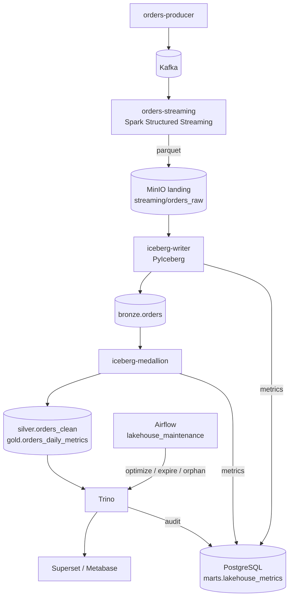
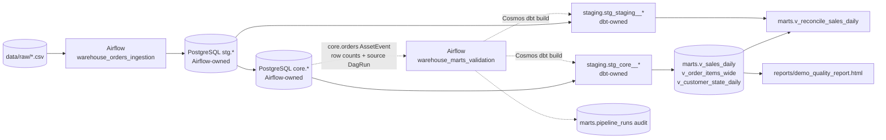
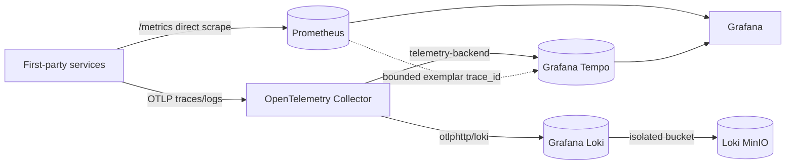

<!-- generated-by: gsd-doc-writer -->
# Architecture

## System overview

The Local Data Engineering Platform is a Docker Compose-based educational lakehouse and data warehouse that runs entirely on one host. It takes two kinds of input — a Kafka event stream and CSV files — and produces analytics-ready data in an Iceberg lakehouse (queried through Trino) and in a PostgreSQL warehouse (surfaced through Metabase). The design is layered: ingestion and staging, an Iceberg bronze/silver/gold medallion, and BI consumption. Both pipelines share MinIO as S3-compatible object storage and the Iceberg REST catalog as the metadata layer.

## Component diagram

### Real-time orders pipeline

### Batch Olist pipeline

Solid edges are data flow; dashed edges are scheduling and execution.

### Optional observability plane

The Collector is enabled by the `otel` profile and Tempo plus its dedicated
trace store by `observability-next`; the complete NG-0.5 trace capability
requires both profiles. Grafana remains part of the extended stack and its
Tempo datasource is provisioned continuously, becoming functional when the
Tempo backend is running.
Prometheus application metrics remain directly
scraped and, together with PostgreSQL durable metrics, remain authoritative;
no spanmetrics or metrics-generator path is enabled. When NG-0.6 is enabled,
Collector logs use Loki's native OTLP endpoint and Grafana links Tempo spans to
Loki logs (and Loki structured trace IDs back to Tempo). Loki uses a dedicated
MinIO store and finite Compactor retention; third-party/container logs remain
outside the first-wave scope. The complete capability requires both `otel` and
`observability-next` profiles.

## Data flow

### Real-time flow

1. `orders-producer` (`kafka/producer/orders_producer.py`) generates JSON order events and publishes them to the `orders` Kafka topic at a configurable rate (2 events/second by default).
2. `orders-streaming` runs `spark/jobs/orders_streaming.py`, a Spark Structured Streaming job that consumes the topic with a 10-second processing trigger. It produces two outputs:
   - Parquet files written to `s3://de-practicum/streaming/orders_raw` (the landing bucket), partitioned by `event_date`, with checkpoints in `s3://de-practicum/checkpoints/orders_raw`.
   - An upsert into `marts.streaming_orders` in PostgreSQL (checkpoints in `s3://de-practicum/checkpoints/orders_postgres`).
3. `iceberg-writer` runs `iceberg/writer/iceberg_writer.py`, polling the landing bucket every 10 seconds. Settled Parquet files are appended into `bronze.orders` in the Iceberg catalog (partitioned by day), one snapshot per batch. Each append carries a `load-id` in the snapshot summary for idempotency.
4. `iceberg-medallion` runs `iceberg/medallion/iceberg_medallion.py` every 60 seconds. It runs quality assertions on the bronze batch (`order_id`, `amount`, `country`, `status`, `event_time`), overwrites `silver.orders_clean` (deduplicated by `order_id`, highest `business_version` wins — transport ordering never decides; see [ADR-0001 D-1a](adr/0001-incremental-silver-and-gold.md)) and then `gold.orders_daily_metrics` (aggregates per `event_date` / `country` / `status`).
5. Trino reads the Iceberg tables through the REST catalog for SQL analytics, and Superset / Metabase provide dashboards.
6. Each writer batch writes a single observability row to `marts.lakehouse_metrics` in PostgreSQL (`iceberg/common/ops.py`); a medallion cycle writes one row per executed phase (`b2`, `shadow`, `gold`) plus a `cycle` envelope row written last, all sharing a `cycle_id`. Together they cover rows/files per batch, row counts per layer, duplicates removed, quality violations, and duration. B2 cycles also record affected-key scan files/bytes and the data files/bytes and snapshot delta produced by the Silver overwrite.
7. Airflow DAG `lakehouse_maintenance` (`dags/lakehouse_maintenance.py`) runs hourly (and on manual trigger): one mapped table instance at a time invokes Trino's `ALTER TABLE ... EXECUTE` table procedures (`optimize`, `expire_snapshots(clean_expired_metadata=false)`, `remove_orphan_files`) on `bronze.orders`, `silver.orders_clean`, and `gold.orders_daily_metrics`. Each mapped instance synchronously records its own `ok`/`noop` or `failed:<operation>` before/after result in `marts.maintenance_runs`; failures remain failed.

The same streaming job also upserts every micro-batch into PostgreSQL `marts.streaming_orders`; this is the second output of the Spark query and is independent of the Iceberg path. It is an independently derived low-latency serving/cache surface, not the authoritative current-state domain projection. Its upsert is monotonic on `business_version`: late or equal-version observations cannot replace a newer row. Authoritative current-state semantics remain owned by the PyIceberg medallion path.

### Batch flow

1. Raw Olist CSV files in `data/raw/` are loaded only by the manually triggered, single-active-run `warehouse_orders_ingestion` DAG in `dags/warehouse_orders.py`.
2. Ingestion requires exact non-empty parity across all four CSV/staging pairs before running the unchanged `db/pipeline_sql/10_rebuild_core.sql`. A read-only readiness task then proves `core.orders` and `core.order_items` are queryable and records their row counts; zero rows alone is not a new failure rule.
3. Only the terminal publisher emits the two core Asset events. The `core.orders` event schedules `warehouse_marts_validation`; predecessor failure therefore produces neither a scheduling event nor a downstream DagRun.
4. The downstream DAG validates the existing marts views, performs the unchanged payment reconciliation, publishes mart Assets, and writes `marts.pipeline_runs`. Its own DagRun ID remains `run_id`; the source ingestion ID comes from `AssetEvent.source_dag_run.run_id` and is stored in nullable, non-unique-indexed `ingestion_run_id`.
5. `marts` remain PostgreSQL views and are consumed for reporting; `scripts/build_report.cmd` (or `.sh`) renders `reports/demo_quality_report.html`. <!-- VERIFY: reports/demo_quality_report.html is a runtime artifact generated by the build_report script, not committed to the repo -->

Inside `warehouse_marts_validation`, Cosmos runs `dbt build` for the
`warehouse_transform` project. dbt owns two layers, not one. Four dbt staging
models — `staging.stg_core__*` and `staging.stg_staging__*` — are the only models
that read a raw `core.*` or `stg.*` relation. The four `marts.v_*` views read
those dbt staging models with `ref()`. Two layers here have the name "staging"
and they are different layers: `stg.*` is the Airflow CSV arrival point, and
`staging.*` holds the dbt staging models. CI enforces this rule on every pull
request — see [W4 — dbt architecture gate](warehouse/W4-dbt-architecture-gate.md).
The warehouse documents are indexed in [docs/warehouse/](warehouse/README.md).

## Key abstractions

- **PyIceberg `RestCatalog`** — every Iceberg read/write goes through this REST catalog client configured for MinIO (path-style S3 access). See `iceberg/writer/iceberg_writer.py:167` and `iceberg/medallion/iceberg_medallion.py:72`.
- **`load-id` snapshot property** — each writer append calls `Table.append(..., snapshot_properties={"load-id": ...})`; the ID is recovered from `snapshot.summary.additional_properties` so the writer can tell committed from uncommitted batches. See `iceberg/writer/iceberg_writer.py:194` and `iceberg/writer/iceberg_writer.py:264`.
- **Writer state file** — `/state/ingested.json` holds `done` (acknowledged files) and `pending` (recorded-but-not-acked files per load) entries that make ingestion crash-recoverable. See `iceberg/writer/iceberg_writer.py:74`.
- **PyArrow medallion transforms** — `build_silver()` deduplicates via a sorted `group_by` with the `hash_first` ordered aggregator; `build_gold()` aggregates with count/sum/mean/count_distinct. See `iceberg/medallion/iceberg_medallion.py:105` and `iceberg/medallion/iceberg_medallion.py:152`.
- **`Metrics` observability helper** — `iceberg/common/ops.py` provides a best-effort `record()` that writes one row per writer batch and, per medallion cycle, one row per executed phase plus a `cycle` envelope row (toggle `METRICS_ENABLED`); a Postgres failure is logged and never breaks ingestion. `classify_metric_row` is the executable rule for reading rows written before phases existed.
- **Trino table-procedure maintenance** — the `lakehouse_maintenance` DAG calls `ALTER TABLE <t> EXECUTE optimize`, `expire_snapshots`, and `remove_orphan_files` once through Trino's `iceberg` catalog. `clean_expired_metadata=false` retains obsolete schema/spec metadata while snapshot/file retention continues. Each scheduler-serialized map owns its audit row in `marts.maintenance_runs`. See `dags/lakehouse_maintenance.py`.
- **Spark Structured Streaming with two sinks** — a single `readStream` feeds both a Parquet writeStream and a `foreachBatch` PostgreSQL upsert. See `spark/jobs/orders_streaming.py`.
- **Airflow Asset scheduling boundary** — TaskGroups in `dags/warehouse_orders.py` separate staging/core ingestion from marts quality/publication. Only `core.publish_core_assets` declares core outlets; `warehouse_marts_validation` is scheduled by `core.orders` and obtains source provenance from the native triggering event.
- **Work a cycle can skip** — both skips are memoisation, never a partial result. Gold is rebuilt in full whenever persisted Silver moves, and left in place only when the current Gold snapshot's `source-silver-snapshot-id` already names the current persisted Silver snapshot (the D-4 amendment in [ADR-0001](adr/0001-incremental-silver-and-gold.md)); a Trino maintenance rewrite drops that property and deliberately costs one extra rebuild. The shadow comparison is skipped only while a durable certificate covers the current Bronze, the current persisted Silver, the runtime identity and the projection contract, and the certified pair is re-checked after the incremental writer runs. Any failure to establish those facts — absent, unparsable, superseded or stale — results in doing the full work, and a certificate found stale after the Bronze pin was already skipped fails the cycle closed before Gold.
- **Three provenance axes** — structural lineage (dbt manifests, Airflow Assets), execution/certification provenance (DagRun IDs, `marts.pipeline_runs`, `cycle_id`), and data-state provenance (`load-id`, completion receipts, snapshot IDs) are separate records answering separate questions. What each one proves, and what it does not, is recorded in [LINEAGE.md](LINEAGE.md).
- **Compose wrapper `stack.ps1`** — thin PowerShell facade over `scripts/stack-*.ps1` for the common `up`, `down`, `build`, `status`, `logs`, `reset` operations.

## Directory structure rationale

| Directory | Purpose |
|---|---|
| `dags/` | Airflow DAG definitions (`warehouse_orders.py`, `lakehouse_maintenance.py`). |
| `db/` | PostgreSQL init scripts, demo SQL, and SQL-based quality checks mounted into the Postgres container. |
| `data/` | Raw CSV input and shared data mounted into Airflow/Spark/Jupyter containers. |
| `docs/` | Documentation, DBML schemas, and exercise/troubleshooting guides. |
| `iceberg/` | PyIceberg services: `writer/` (landing → bronze), `medallion/` (bronze → silver/gold, quality checks), plus the shared `Dockerfile` and `common/ops.py` (metrics helper). |
| `observability/` | OpenTelemetry Collector, Tempo, and Grafana provisioning for the optional trace profile. |
| `jupyter/` | Jupyter image with PySpark/Spark Connect access for interactive development. |
| `kafka/` | Kafka producer source (`producer/orders_producer.py`). |
| `scripts/` | PowerShell/sh/cmd operational scripts (doctor, checks, stack lifecycle). |
| `spark/` | Spark image and jobs (`jobs/orders_streaming.py`, `jobs/build_mart.py`, `jobs/verify_bronze_orders.py`). |
| `superset/` | Superset configuration (`superset/superset_config.py`). |
| `trino/` | Trino config mounted into the container; the Iceberg catalog properties are generated at startup from `etc/catalog/iceberg.properties.template`. |
| `imgs/` | Repository images referenced by documentation. |

Top-level Compose files split concerns: `docker-compose.yml` holds the base batch stack (PostgreSQL + Airflow), `docker-compose.extended.yml` adds the real-time and lakehouse services (MinIO, Spark, Kafka, Iceberg, Trino, BI), and `docker-compose.local-airflow.yml` is an offline fallback for the base stack.
