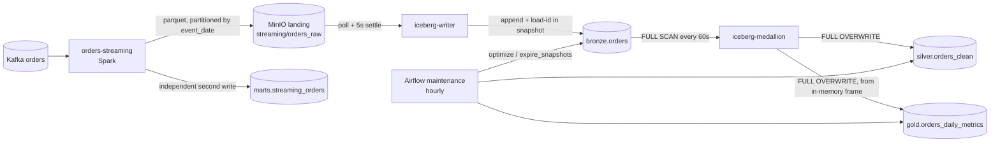
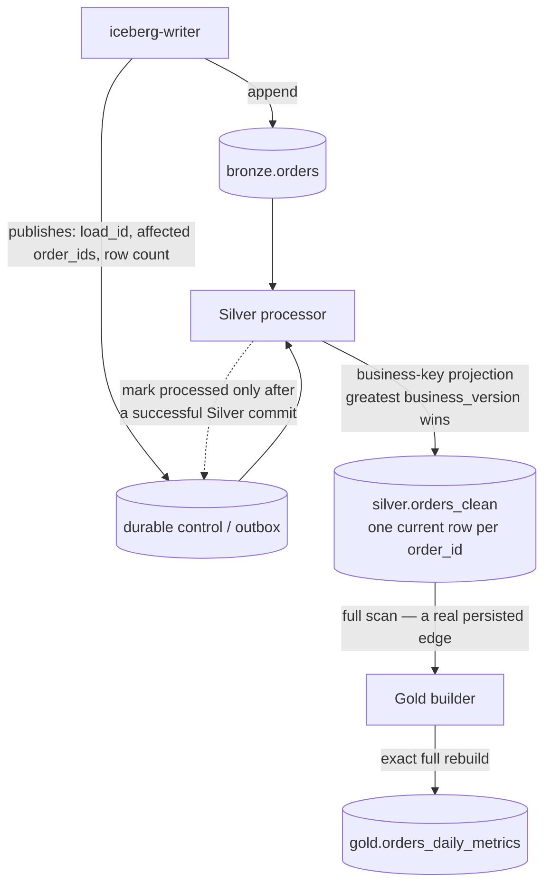
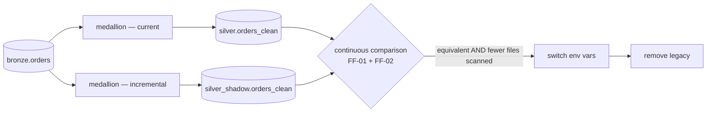

# ADR-0001 — Incremental Silver and Gold

| | |
|---|---|
| **Status** | **Proposed** — P-0, D-1, D-1a, D-2, D-4 and PREREQ-1 accepted; **D-3 open, blocked on SPIKE-1** |
| **Date** | 2026-08-08 (revised same day: D-1 closed as mutable lifecycle, D-3 reopened) |
| **Deciders** | *(unassigned)* |
| **Supersedes** | nothing — this is the repository's first ADR |
| **Evidence base** | [`docs/architecture-audit/baseline/`](../architecture-audit/baseline/README.md) — committed, frozen |

This is the first architecture decision record in this repository. Until now every architectural
rule in the system was reconstructed from prose in `docs/ARCHITECTURE.md`, and the audit that
produced this document had to record that fact as its own most durable finding: **zero ADRs, nine
declared rules, one prose source.** That is why conformance scoring is suppressed everywhere in
the audit, and why this document exists before any code changes.

---

## P-0 — Foundational decision: the domain model needs a single authoritative source

**This decision sits above all four that follow, and it is not about which domain model is
correct. It is about the fact that there is currently no way to answer that question.**

Three artifacts in this repository answer *"what does a repeated `order_id` mean?"* and they
disagree:

| Artifact | Says | Evidence |
|---|---|---|
| `kafka/producer/orders_producer.py:59` | **Immutable event** — a fresh `uuid4` per event; no `order_id` ever recurs | `create_event()` |
| `tests/e2e/test_lakehouse_e2e.py:118` | **Mutable entity** — publishes one `order_id` twice with different `customer`, `amount`, `status`, and asserts the later wins | `build_fixture()`, asserted at `:1017` |
| `spark/jobs/orders_streaming.py:179` | **Mutable entity** — `order_id varchar primary key` with `on conflict (order_id) do update set customer, amount, country, status` | `marts.streaming_orders` DDL |

Two of three say mutable. The dissenting one is the one that generates the live data. The most
formal statement — a `PRIMARY KEY` with an `UPDATE` of business attributes — is a DDL-level
declaration that an order mutates, and nothing reconciles it with the generator.

### Decision

> **The domain model has exactly one authoritative source, and it is declared here in this ADR.
> Where the producer, the test fixtures and the database schema disagree, this document is
> normative and the artifacts are brought into line with it — not the other way round.**

### Why this is a decision and not a preamble

Without P-0 stated explicitly, the disagreement re-emerges as a technical argument that cannot be
settled on technical grounds. It already has: the audit's two phases assigned *different
severities to the same finding* (F-303) because each reasoned from a different domain assumption,
and both were correct within their own.

The observable consequence is predictable. In six months someone reopens the question as a debate
about `MERGE` semantics, without recognising that the disagreement is not about `MERGE` at all.

### Consequences

- Every domain-semantic claim in code, tests or DDL must be traceable to this ADR or to a
  successor.
- Changing the generator's emission semantics becomes an **architectural** change requiring an ADR
  amendment, not a fixture tweak.
- The three artifacts above are, as of this document, **known to be inconsistent**. Closing D-1
  requires changing at least one of them.

---

## 1. Context

### What exists



### The constraints that actually bind

Not a wish-list. Each is a verified property of the system as it stands.

| ID | Constraint | Location |
|---|---|---|
| **F-701** | **Bronze has no row-level provenance.** Ten columns, none recording when or by which load a row arrived. `kafka_offset` is per-partition monotonic; `kafka_timestamp` is an event clock. **No column exists on which a watermark could be built.** | `iceberg_writer.py:56-67` |
| **F-704** | **The pinned pyiceberg 0.11.1 has no incremental scan.** `Table` exposes only `append` and `scan`; `scan(snapshot_id=…)` is time travel, not a delta. `overwrite(overwrite_filter=…)` *is* available. | `iceberg/Dockerfile:3`, API introspection |
| **F-301** | **Bronze snapshot history has two owners.** It is the writer's idempotency ledger *and* the maintenance DAG expires it hourly at a 1h threshold. No rule reconciles retention with recovery. | `iceberg_writer.py:207`, `lakehouse_maintenance.py:111` |
| **F-302** | **The silver→gold edge does not exist.** `build_gold(silver_df)` reads the in-memory frame. Gold is unpartitioned (`PartitionSpec()`). Its aggregates are `count_distinct` and `mean`. | `iceberg_medallion.py:290, 291, 196` |
| **F-303** | **`Table.upsert` cannot express AR-004.** `when_matched_update_all` takes no predicate, so a lower `kafka_offset` overwrites a higher one. No identifier fields exist. The match key is uncorrelated with the partition spec, so no pruning. | `iceberg_medallion.py:53, 66`, pyiceberg 0.11.1 |
| **F-702** | **Every event lands in one partition.** `event_time = now()` → `event_date` = today → the changed-partition set is always a single partition holding the whole working set. | `orders_producer.py:64` |
| **F-703** | **Landing→Bronze has no commit contract.** A five-second mtime heuristic stands in for Spark's `_spark_metadata`; the `/_temporary/` guard is aimed at the batch committer, not the streaming one. | `iceberg_writer.py:113-144` |
| **F-708** | **Partition-scoped dedup is correct only while `order_id` → `event_date` is functionally determined.** True today only because the generator never repeats an order. Unstated, untested. **D-1 decided this invariant does not hold** — see §4, option C. | `orders_producer.py:59` |
| **F-1005/1006** | **No live-stack test blocks a PR** (`ci-integration` triggers on push to `main`), and **every fixture is single-partition**. | workflows, `test_lakehouse_e2e.py:77` |

### The thing that makes this hard

The audit's central finding, confirmed and widened across three phases:

> **Full overwrite is not a performance choice. It is the mechanism that substitutes for progress
> state — and for the ordering semantics of AR-004, and for the missing silver→gold edge. It is
> additionally repairing duplicate rows in Bronze on every cycle.**

Falsification was attempted and failed: `bronze.scan().to_arrow()` at `iceberg_medallion.py:257`
is unfiltered and unordered, and nothing crosses between cycles. The rebuild is a pure function of
the full Bronze state.

**The principal risk is treating this as one change.** It is three reconstructions that happen to
share a trigger.

---

## 2. Evidence

**This ADR is self-sufficient.** Every constraint in §1 and every argument below carries a
`file:line` reference into this repository, and each can be checked by reading the code. Nothing
here requires the reader to open the audit.

The audit baseline is committed at
[`docs/architecture-audit/baseline/`](../architecture-audit/baseline/README.md) for a different
purpose: it is the frozen reference a later `verify-architecture-remediation` run compares
against, and it records what the audit examined, what it skipped, and what it never observed.

| Artifact | Purpose | sha256 |
|---|---|---|
| `baseline/synthesis/architecture-findings.json` | 28 findings with full evidence chains | `8417535f73fc2a34…` |
| `baseline/synthesis/synthesis.md` | The verdict and its reasoning | `b896fb5540f49957…` |
| `baseline/synthesis/rejected-or-deferred-findings.md` | What was challenged, deferred, and what would overturn it | `9d47c9751de69866…` |
| `baseline/synthesis/coverage.md` | Scope, method, and everything not observed | `628c1dd9dd13e053…` |

Digests are **traceability, not a precondition for understanding this document.** Intermediate
audit artifacts — inventory, intent profile, per-specialist findings — are local working state and
are deliberately not committed; their digests are recorded inside `architecture-findings.json` so
drift can be detected if they are ever regenerated.

### What the evidence does *not* cover

Stated so this ADR can be attacked rather than merely believed.

- **No live stack was started in any phase.** No orphan landing file, commit conflict, duplicate
  append or concurrency window was ever reproduced. F-703's confidence is `medium` for exactly
  this reason.
- **Five specialist audits were deliberately not run** — clean/hexagonal, modularity & SOLID, DDD,
  security, quality attributes. Absence of a finding is not evidence of absence.
- **The largest unexamined alternative is a runtime change.** Moving the medallion to Spark or
  Trino would give engine-native change tracking and make F-701, F-704 and much of D-2 irrelevant.
  It was out of scope because the profile fixed the medallion as a pyiceberg process. **It was
  never evaluated.**

---

## 3. Decisions

### D-1 — Order domain semantics · ✅ **ACCEPTED — mutable business entity**

> **An order is a mutable business entity. Kafka records are immutable, versioned observations of
> that entity.**
>
> - `order_id` identifies the business entity.
> - `business_version` is the authoritative per-order version.
> - Silver contains **exactly one** current representation of each `order_id`.
> - The row with the greatest `business_version` wins.
> - Re-delivery of the same `(order_id, business_version)` is idempotent.
> - The same `(order_id, business_version)` carrying a **different** payload is a data-quality
>   violation and MUST NOT be resolved silently.

#### Why B, over A

The evidence was never 2:1 by count alone — the three artifacts carry different weight:

| Artifact | Weight |
|---|---|
| The e2e fixture | **Behavioural.** It does not merely permit an update, it *asserts* one: `dup-1` must resolve to `(erin, 30.0, delivered)`, the second payload |
| The Postgres serving DDL | **Formal and persisted.** `PRIMARY KEY (order_id)` with `ON CONFLICT DO UPDATE` of business attributes is a schema-level declaration that an order mutates |
| `status` | **Vocabulary.** `created / paid / shipped / delivered` is a lifecycle, already |
| The producer's `uuid4` | **Incidental.** The only artifact modelling immutable entities, and the cheapest of the four to change |

The weakest candidate for the source of domain truth is the generator. Building the whole Silver
architecture around its accidental simplicity would be backwards.

**And for a data-engineering practicum, B is materially more valuable.** Under A, most of the
interesting findings in this audit become edge cases the producer can never produce. Under B, the
platform genuinely demonstrates late and out-of-order delivery, replay, stateful projection,
version resolution, idempotency, recovery, shadow migration, and — most usefully — **the
difference between transport ordering and business ordering.**

#### D-1a — `business_version`, not `kafka_offset` · ✅ **ACCEPTED**

`kafka_offset` is **not** the version comparator. Two concepts are separated:

```text
business_version  = domain ordering
kafka partition / offset = transport ordering
```

This removes a hidden coupling that would otherwise be permanent:

```text
change Kafka partition count → an order may move to another partition
    → offsets no longer comparable → business semantics silently change
```

With `business_version`, changing the partition count stops being a change to the domain model.
The producer should still key by `order_id` — it is good for locality and load distribution — but
**Silver's correctness no longer depends on it.**

#### The resolution table this produces

Stronger than "latest `kafka_offset` wins", and each row is directly testable:

| Situation | Outcome |
|---|---|
| v4, then v4 replayed with identical payload | Harmless duplicate — idempotent, Silver unchanged |
| v4, then a **second v4 with a different payload** | **Invalid data.** Must surface, must not be silently resolved |
| v3 arriving after v4 | Valid late or replayed event — Silver unchanged |
| v5 | Advances Silver |

#### What this costs

- **`business_version` must be added to the event contract** and to all four schema declarations —
  Spark `ORDER_SCHEMA`, Bronze `TABLE_SCHEMA`, Silver `SILVER_SCHEMA`, and `marts.streaming_orders`.
  F-706 priced this: the declarations are hand-maintained with no compatibility test, which is why
  **FF-08 should land before this change, not after.**
- **The generator must emit lifecycle transitions** — reusing `order_id` across events and
  incrementing `business_version`.
- **The e2e fixture must carry versions.** Its `dup-1/2/3` rows already model updates; they need
  explicit versions and should gain a case for each row of the resolution table above.

#### D-1-R1 — transport ordering · **demoted by D-1a, deliberately retained**

An earlier draft of this ADR made the Kafka partition contract a *correctness* requirement,
because `kafka_offset` was the candidate version comparator. **D-1a removes that.** The rule is
kept here, downgraded, because the analysis behind it explains why D-1a was worth its cost.

What the audit established, and it is worth stating precisely because it is easy to get wrong:

- **The producer already keys by `order_id`** — `key=event["order_id"].encode("utf-8")` at
  `orders_producer.py:92`. The default partitioner therefore co-locates every version of an order
  **at any partition count**. The single partition is *not* what makes offsets comparable.
- **The single partition is a broker default, not a decision.** No `KAFKA_NUM_PARTITIONS` is set;
  the `orders` topic is auto-created. The only place a partition count is written down anywhere is
  `--partitions 1` in the e2e suite (`test_lakehouse_e2e.py:316`), and that is test-only.
- **The residual risk was never multi-partition operation.** It was a *change* in partition count:
  the partitioner is `hash(key) % partitions`, so increasing the count remaps existing keys. An
  order whose versions straddle that change lands in two partitions and loses its ordering, and
  **Kafka would report nothing.** A routine, permitted operation would have silently changed
  domain semantics.

That is the coupling D-1a buys its way out of. Under `business_version`, changing the partition
count is an operational change with no semantic consequence.

**Retained as a non-correctness rule:** continue keying by `order_id`. It preserves per-order
locality and even load distribution, and it keeps transport ordering aligned with business
ordering in the common case — which makes divergence easier to spot. It is no longer load-bearing,
and **FF-13 is downgraded accordingly** (see §7).

### D-2 — Progress ownership · ✅ **ACCEPTED**

> **Medallion progress is durable, explicit control state owned by the component that writes it.
> It MUST NOT be derived from Bronze snapshot history, whose retention belongs to the maintenance
> DAG.**
>
> ```text
> Bronze commit → durable explicit control / outbox state → Silver processor
>     → mark processed only after a successful Silver commit
> ```
>
> A Bronze snapshot id MAY be stored alongside as evidence or as a reference for diagnostics. It
> MUST NOT be the only durable progress mechanism.

D-1 did not change this conclusion. The reasoning below stands as originally recorded.

**Eliminated on evidence:**

- **Kafka offsets** — per-partition monotonic only, and two hops behind by the time data reaches
  Bronze. Not a global watermark.
- **A row-level watermark on existing Bronze columns** — F-701: no such column exists.

**Viable, with their real costs:**

| Option | Cost |
|---|---|
| Bronze snapshot ids | Inherits F-301's retention dependency **and** F-704's missing API; requires hand-rolled manifest diffing on library internals |
| Medallion control table | Depends on nothing the medallion does not own — but `marts` has five DDL owners, three issuing runtime DDL, one of them a student exercise, all on one credential (F-305) |
| **Writer-published outbox** | The writer already holds the delta in memory at append time |

**Chosen: the writer-published outbox.** It is the only option that *removes* a cross-component
ownership conflict instead of adding one, and it takes F-301 off the medallion's critical path
entirely. This is an argument from ownership, not from performance.

**Binding constraint:** the control state must be **atomically written and bounded**. The one
existing precedent — the writer's `done` set, serialised in full through a truncating write on
every load (F-707) — is neither, and must not be copied. It also must not live in `marts` as that
schema currently stands (F-305: five DDL owners, one of them a student exercise).

### D-3 — Silver execution model · ⛔ **OPEN — reopened by D-1**

**The earlier conditional recommendation of option F is withdrawn.** D-1 did not merely re-rank
the options; it invalidated the mechanism at the centre of options C and F.

#### Why changed-partition rebuild no longer works

Silver is partitioned by `event_date`. Under a mutable lifecycle, an order's versions can fall in
different partitions:

```text
order X  v1  event_date = 2026-08-08   → written to partition 08-08
order X  v2  event_date = 2026-08-09   → rebuild touches partition 08-09 only
                                       → v1 is STILL THERE in partition 08-08
                                       → Silver now holds two rows for order X
```

A scoped rebuild of the changed partition cannot delete a representation living in a partition it
never reads. **Scoped partition rebuild is therefore no longer a sufficient correctness model** —
the invariant "exactly one current representation per `order_id`" is global, and cannot be
enforced by an operation whose scope is local.

This is F-708 arriving as a consequence rather than as a risk. The audit flagged the invariant as
unstated and untested; D-1 has now decided that it does not hold.

#### What D-1 requires instead

A **business-key projection**: the unit of work is the affected set of `order_id` values, not the
affected set of partitions. That is option B's shape — and option B was priced with F-303:

> `Table.upsert` in pyiceberg 0.11.1 cannot atomically express
> `WHEN MATCHED AND source.business_version > target.business_version THEN UPDATE`.
> `when_matched_update_all` takes no predicate.

Writing a hand-rolled quasi-MERGE on top of pyiceberg to work around that is exactly the kind of
machinery this ADR rejected when it eliminated option A.

#### SPIKE-1 — narrow capability check, blocking D-3

This is **not** a new architecture audit. It is a check of one alternative the audit recorded as
unexamined and which D-1 has made directly relevant.

> **Can the Trino or Spark path already present in this stack express a conditional Iceberg MERGE
> safely and efficiently?**
>
> ```sql
> MERGE INTO silver.orders_clean t USING <delta> s ON t.order_id = s.order_id
> WHEN MATCHED AND s.business_version > t.business_version THEN UPDATE SET ...
> WHEN NOT MATCHED THEN INSERT ...
> ```

**Established statically, before the spike runs:**

| Fact | Consequence |
|---|---|
| **Trino 483** is already in the stack, wired to the same REST catalog, and `dags/lakehouse_maintenance.py` already executes statements through the `trino` Python client | A Trino-executing component is an established pattern here. **Zero new infrastructure.** |
| **Spark 4.2.0** carries no Iceberg runtime — `--packages` is kafka, hadoop-aws, postgresql only (`docker-compose.extended.yml:392`). Released `iceberg-spark-runtime` artifacts target Spark 3.4 / 3.5 / 4.0 | Spark is the expensive path and **may be blocked outright** by the absence of a 4.2-compatible runtime |
| Tables are created at **format-version 2** (`pyiceberg.TableProperties.DEFAULT_FORMAT_VERSION = 2`); nothing in the repo overrides it | The precondition for row-level MERGE is already met. **No format migration needed.** |

**A priori this strongly favours Trino.** The spike must still measure, not assume.

**Questions the spike must answer:**

1. Does Trino 483's Iceberg connector accept the conditional `WHEN MATCHED AND …` clause above,
   and does it apply the predicate correctly for out-of-order versions?
2. Which delete mode results — copy-on-write or merge-on-read position deletes? `write.delete.mode`
   is unset on these tables.
3. **Can pyiceberg 0.11.1 read a table Trino has written with position deletes?** This is the
   critical one: the medallion reads Silver through pyiceberg, and D-4 requires Gold to be rebuilt
   from persisted Silver. If this fails, the whole shape fails.
4. What does merge-on-read do to `lakehouse_maintenance`? `optimize` and `expire_snapshots` would
   now also be managing delete files — a direct interaction with F-301 and F-307.
5. Cost per cycle on a realistic Silver, versus the full overwrite baseline (FF-02's measure).

**Non-goal:** the spike does not choose the architecture. It answers whether the engine can carry
the semantics D-1 requires, so that D-3 can be decided on evidence.

**Likely outcome if the answer is yes** — recorded as a hypothesis, not a decision:

```text
PyIceberg        → catalog, writer, control-plane
Trino (or Spark) → mutable Silver projection via conditional MERGE
```

That is preferable to hand-building a quasi-MERGE over pyiceberg, and it uses the stack as it
already exists.

### D-4 — Gold execution model · ✅ **ACCEPTED**

**D-1 strengthens this rather than disturbing it.** The boundary is now unusually clean:

```text
mutable, versioned events → current-state persisted Silver → deterministic full Gold rebuild
```

**Gold does not participate in the lifecycle at all.** Its input contract is *current persisted
Silver state*, never events, never versions, never deltas. Every complication D-1 introduces —
version resolution, out-of-order arrival, idempotency — is absorbed by Silver and never reaches
Gold. That is the whole value of the boundary.


> **Gold is not made incremental. It is rebuilt in full from persisted Silver on every cycle.**

| Reason | Detail |
|---|---|
| Non-composable aggregates | `count_distinct` and `mean` do not compose from a delta |
| Scale | One row per `event_date × country × status` — tens of rows |
| The missing edge | The silver→gold read must be created regardless; a full rebuild creates it as a side effect |
| Physical layout | Gold is unpartitioned, so any scoped rewrite rewrites the whole table anyway |
| Machinery cost | Incremental would need HLL-style sketch state to guard tens of rows |
| **Verifiability** | **A full rebuild is exactly verifiable. An incremental aggregate with sketches is only approximately verifiable.** |

Recorded explicitly because *"incremental Silver **and** Gold"* is the intuitive framing and the
evidence contradicts it. The phase is more accurately:

```text
Scoped-rebuild Silver  +  Persisted Silver → deterministic full Gold rebuild
```

### PREREQ-1 — Bronze commit contract · **not a decision**

F-703 is a missing contract, not a design choice. It exists independently of everything above and
would remain after any option ships. It concerns whether Bronze is a trustworthy log at all.

**Two claims here have different evidential standing, and they are ratified separately:**

| | Standing |
|---|---|
| **The decision** — introduce a real commit-boundary contract for Landing → Bronze, replacing the five-second mtime heuristic | ✅ **Ratified.** The contract is absent regardless of whether its absence has ever produced a failure. A time-based guess standing in for a commit is not defensible in a design, and the `/_temporary/` guard demonstrably targets the wrong protocol. |
| **The claim** — the existing heuristic has caused, or is likely to cause, observable duplicate or orphan ingestion | ⚠️ **Not ratified.** F-703 carries `confidence: medium`. It was never reproduced; no live stack was started, no orphan file was found. Spark's file-sink semantics are documented behaviour, not measurement. |

We are fixing a **missing correctness contract**. We are **not** asserting an observed production
failure. Conflating the two would overstate the evidence and weaken every other claim in this
document by association.

**It proceeds in parallel.** Smallest form: extract eligibility from `list_new_files` into a pure
function — *given a listing and the set of committed paths, return the eligible files* — and test
it on the PR tier.

---

## 4. Alternatives considered

Six options were assessed against the pinned stack. **D-1 subsequently eliminated two more** — the
verdicts below are the post-D-1 state, with the pre-D-1 reasoning preserved so the reversal is
legible.

| | Available in 0.11.1 | Verdict |
|---|---|---|
| **A** · snapshot-delta + selective partition overwrite | **no** | **Eliminated (pre-D-1).** Requires rebuilding an incremental scan from `inspect` metadata, on library internals, on top of snapshots F-301 lets maintenance delete. Highest machinery cost of the six. |
| **B** · business-key upsert | yes | **The required shape.** D-1 makes the unit of work the affected `order_id` set. Its F-702 immunity is now a benefit rather than a tiebreak — but F-303 stands: pyiceberg's `when_matched_update_all` takes no predicate, so the *engine* question moves to **SPIKE-1**. |
| **C** · changed-partition rebuild | yes | **Eliminated by D-1.** Was the leading candidate: only `scan(row_filter)` + `overwrite(overwrite_filter)`, idempotent by construction, F-303 dissolving rather than mitigated. **It rested entirely on F-708's invariant, and D-1 decided that invariant does not hold.** A scoped rebuild cannot delete a stale representation in a partition it never reads. |
| **D** · Silver changelog / CDC intermediate | yes | **Eliminated (pre-D-1).** A fourth persisted layer and a fourth schema declaration in a system already failing to keep three in sync (F-706). No consumer needs row-level change events. |
| **E** · control / progress table | yes | **Not an alternative.** It is the missing component *every* other option needs. **Accepted as D-2.** |
| **F** · writer outbox + changed-partition Silver + full Gold rebuild | yes | **Withdrawn by D-1.** Its Silver half was C. Its other two parts survive intact and are now D-2 and D-4 — the outbox and the exact Gold rebuild from persisted Silver. |

### What actually decided it, and it was not the ranking

The pre-D-1 analysis turned on a trade-off between **C** and **B**: C was correct and cheap but
demonstrated nothing until F-702 was fixed, while B was insensitive to F-702 but carried every
constraint in F-303. The conclusion was that F-702 would decide the ranking.

**That framing did not survive D-1.** The domain decision did not re-rank the options — it
removed C's correctness, and with it F's. A trade-off analysis was answered by a domain fact,
which is the strongest argument in this document for having settled P-0 and D-1 first.

### F-702's role has changed

`DataScan.plan_files()` still makes files-per-cycle observable with no instrumentation, and
**FF-02 is still required** — it remains the only evidence that the change achieved anything.

But it is no longer a *design* input. With a business-key projection the unit of work is the
affected `order_id` set, not the partition set, so a single hot partition no longer flattens the
optimisation. F-702 became a measurement obligation rather than a blocker.

The original reasoning is retained because it avoided both failure modes worth avoiding: choosing
an architecture to fit an artificially simple generator,
and choosing a data shape to fit a preferred architecture.

---

## 5. Chosen architecture

**Partially decided. Recorded honestly rather than forced to completion.**

| Decision | Status |
|---|---|
| **P-0** Canonical domain model | ✅ **Accepted** — this ADR is the single authoritative source |
| **D-1** Order domain semantics | ✅ **Accepted** — mutable business entity, versioned observations |
| **D-1a** Version comparator | ✅ **Accepted** — explicit `business_version`, not `kafka_offset` |
| **D-2** Progress ownership | ✅ **Accepted** — durable explicit control state, writer-published; never derived from Bronze snapshot retention |
| **D-3** Silver execution model | ⛔ **Open** — business-key projection required; engine pending **SPIKE-1** |
| **D-4** Gold execution model | ✅ **Accepted** — exact full rebuild from persisted Silver |
| **PREREQ-1** Bronze commit contract | ✅ **Accepted** (decision only — the severity claim is not ratified) |

**This ADR remains `Proposed` solely because of D-3.** Everything else is settled.

### The settled shape



### What is still undetermined

**Only the box labelled "business-key projection"** — specifically which engine executes it, and
therefore how the conditional update is expressed. SPIKE-1 answers that.

Everything else in the diagram is decided: the control state and its ownership, the versioned
resolution rule, the one-row-per-`order_id` invariant, the persisted Silver→Gold edge, and Gold's
exact full rebuild.

**What was lost, and it is worth naming.** The earlier target preserved a property this one does
not: *the rebuild of a scope was a pure function of Bronze, so re-running it was a no-op.* Under a
business-key projection, idempotency has to be **constructed** — from `business_version` monotonicity
and the control state — rather than inherited from determinism. That is a real cost of D-1, and it
is why FF-03 and FF-04 stop being regression guards and become primary correctness guards.

---

## 6. Migration strategy — shadow Silver

**The mechanism already exists and is unused.** Every medallion table identifier is an environment
variable — `SILVER_NAMESPACE`, `SILVER_TABLE`, `GOLD_NAMESPACE`, `GOLD_TABLE`
(`iceberg_medallion.py:35-42`), passed explicitly by the compose service. **A second medallion
writing to a shadow Silver needs no code change at all.**



1. **Run both.** Two medallion containers, same Bronze, different Silver/Gold targets. Both only
   read Bronze; neither writes it, so they cannot conflict.
2. **Compare continuously.** FF-01 (equivalence) and FF-02 (scan volume) run against **two live
   tables**, not two code paths in a test. Real data, accumulated over cycles, not a fixture.
3. **Switch** by changing two environment variables.
4. **Remove** the legacy path only after every exit criterion below is met.

This converts the riskiest change in the project from a speculation into an observation, and it is
simultaneously the cheapest possible implementation of FF-01.

### Exit criteria — all must hold before the switch

Stated as checks, not as a feeling. The numbers are adjustable; **replacing them with a judgement
call is not.**

| # | Criterion | Why this one |
|---|---|---|
| **X-1** | ≥ 50 consecutive cycles with **zero** row-level differences between `silver` and `silver_shadow`, compared against a **pinned Bronze snapshot** so both see identical input | FF-01 against real accumulated data rather than a fixture. Snapshot pinning is what makes the comparison non-racy while the writer keeps appending |
| **X-2** | `silver_shadow` plans **strictly fewer** data files than the full rebuild in ≥ 90% of cycles, measured by `DataScan.plan_files()` | FF-02. Not 100%: a cycle that legitimately touches every partition is allowed. **If this cannot be met, F-702 is unresolved and the change is incremental in name only** |
| **X-3** | The window spans **at least one `event_date` boundary** (local midnight), **and contains at least one order updated across that boundary** | The condition D-1 made real and C could not survive: an order whose versions land in different partitions. This is FF-09's failure case, and midnight is the only time it occurs naturally |
| **X-4** | ≥ 1 unplanned or induced **restart of the shadow medallion** mid-cycle, recovering with no loss and no double-apply | FF-05 under production conditions rather than in a test harness |
| **X-5** | ≥ 1 **maintenance DAG run** completed during the window with the shadow medallion active | Exercises the F-307 concurrency window between `optimize` / `expire_snapshots` and the medallion's commit — the one interaction no test covers |
| **X-6** | Gold rebuilt from **persisted** `silver_shadow` matches Gold rebuilt from `silver`, exactly | FF-06 and D-4. Exact, not approximate — that is the whole argument for a full Gold rebuild |

**If X-2 fails, do not proceed and do not weaken the criterion.** It is the only evidence that the
change achieved anything, and F-702 predicts it will fail until the partition dimension is real.

**X-3 and X-5 are time-bound, not cycle-bound.** With a 60-second cycle and an hourly maintenance
schedule, the window is at least ~24 hours regardless of how quickly X-1 accumulates.

**Table migrations required regardless of D-3's outcome:**

- **Gold partitioning** — currently `PartitionSpec()`. Needed only if Gold ever becomes scoped;
  under D-4 it does not, so this is deferred rather than required.
- **Bronze provenance column** — needed only if D-2 resolves to a row-level marker rather than the
  outbox. Additive, but requires deciding whether existing rows are backfilled or treated as
  pre-epoch.

---

## 7. Fitness functions

Architecture rules in this system are currently **not executable**: 60 tests, all behavioural, not
one asserting ownership, direction, retention, ordering or work volume. Import-plane guards are
unavailable — the single internal import edge is built by runtime `sys.path` mutation and no static
tool resolves it (F-306).

Every guard below is therefore stated against the **data plane**.

| ID | Rule | Statement | Tier | Guards | Domain |
|---|---|---|---|---|---|
| **FF-01** | `TE-FF-EQUIV` | Incremental Silver equals full-rebuild Silver over the same Bronze snapshot | Integration | QAS-001, F-302 | both |
| **FF-02** | `TE-FF-SCAN` | An incremental cycle plans strictly fewer data files than a full rebuild | Integration | F-702, F-1002 | both |
| **FF-03** | `TE-FF-IDEM` | Re-applying the same committed batch leaves Silver unchanged | Integration | F-301, F-703 | both |
| **FF-04** | `TE-FF-ORDER` | A lower `business_version` never overwrites an applied higher one | Integration | F-303, D-1 | **primary** |
| **FF-05** | `TE-FF-RECOVER` | A crash before or after the Silver commit recovers with no loss and no double-apply | Integration | F-1004 | both |
| **FF-06** | `TE-FF-PERSIST` | Gold is built from persisted Silver, not an in-memory frame | Integration | F-302 | both |
| **FF-07** | `TE-FF-COMMIT` | Only files committed per Spark's streaming metadata are eligible for Bronze | **PR** + integration | F-703 | both |
| **FF-08** | `TE-FF-SCHEMA` | The **four** order-schema declarations agree on names, order and nullability — including `business_version` | **PR** | F-706, D-1a | **prerequisite** |
| **FF-09** | `TE-FF-UNIQUE` | **Silver holds exactly one row per `order_id`, globally** | Integration | F-708, D-1 | **primary** |
| **FF-10** | `TE-FF-RETENTION` | `MAINTENANCE_RETENTION` exceeds the maximum writer recovery window | **PR** | F-301 | both |
| **FF-11** | `TE-FF-ATOMIC` | A crash mid-state-write never yields a truncated state file | **PR** | F-707 | both |
| **FF-12** | `TE-FF-RECONCILE` | Produced events equal landed rows plus dead-lettered rows | Integration | F-705 | both |
| **FF-13** | `TE-FF-KEYING` | The producer keys records by `order_id` | **PR** | D-1-R1 | **downgraded** — locality, not correctness |
| **FF-14** | `TE-FF-VERSION-CONFLICT` | Two records sharing `(order_id, business_version)` but carrying different payloads are surfaced as a data-quality violation, never silently resolved | Integration | D-1 | **primary** |

### Five notes that matter more than the table

**FF-01 is only testable because time travel exists.** `Table.scan(snapshot_id=…)` is available in
0.11.1 even though a delta scan is not (F-704). Pin the snapshot and both paths see identical input
despite a continuously appending writer. Without it the test would be inherently racy.

**FF-04 got easier and more important at the same time.** Under the rejected `kafka_offset` model it
could not be built from publication order at all — Kafka assigns offsets in publication order, so the
winning version always arrived last, which is why the existing e2e assertion passes and *cannot*
catch F-303. The only route was replay injection.

With `business_version` decoupled from transport, **a late low version is just an event you can
publish**: emit v5, then publish v3, assert Silver still holds v5. No replay seam needed. And the
guard is no longer conditional or vacuous — D-1 made out-of-order arrival a first-class domain
case, so this is now a **primary** correctness guard rather than a regression test. Replay
injection remains worth having for FF-03, where the failure is duplication rather than regression.

**FF-05 needs a seam that does not exist.** The writer has two crash hooks and a real fault-injection
suite; the medallion has neither, and its tests are entirely mocked. The change makes the medallion
stateful. **Add `SIMULATE_CRASH_BEFORE_SILVER_COMMIT` / `_AFTER_` before writing the progress logic,
not after.** `tests/integration/test_crash_recovery.py` is the template.

**FF-09 inverted, and the inversion is the whole point of D-1.** It previously asserted that no
`order_id` spans two `event_date` partitions in Bronze — the invariant a partition-scoped rebuild
would have depended on. D-1 decided that invariant does **not** hold. The guard now asserts the
property that actually matters and that a scoped rebuild cannot deliver: **Silver holds exactly one
row per `order_id`, globally.** Same finding (F-708), opposite assertion. It is also the single
cheapest test that would catch a mis-scoped projection.

**FF-13 is downgraded, and the analysis behind it is still worth keeping.** Increasing a topic's
partition count is routine and permitted, and Kafka reports nothing — under the *rejected* design
where `kafka_offset` was the comparator, it would have silently changed domain semantics. D-1a
removed that exposure, so this is now a locality assertion, not a correctness gate. **It stays on
the PR tier because it costs almost nothing and it documents the intent.**

Both are good illustrations of why §7 is stated against the data plane: no import-level architecture
tool could ever see either rule. One lives in broker configuration and a single line of producer
code; the other is a property of table contents that only a query can establish.

### Enforcement prerequisite

`ci-integration` triggers on `workflow_dispatch` and **push to `main`** — after the merge. As things
stand, every guard above except FF-07's unit half and the PR-tier ones would run only post-merge.
Add `pull_request`, path-scoped to `iceberg/**`, `spark/**`, `dags/**`, `tests/integration/**`.

### Fixture prerequisite

Every fixture in the repository is single-partition. FF-02 and FF-09 cannot be written until the
e2e fixture spreads across at least three `event_date` values, with one order whose two versions
fall on different dates so FF-09 has a fixture that could violate it.

---

## 8. Rollback

Rollback is close to free, and that is a direct consequence of §6 rather than a separate design.

| Stage | Rollback | Cost |
|---|---|---|
| Shadow running | Stop the shadow container | Zero — the live path was never touched |
| After switch | Revert two environment variables | Seconds; the legacy Silver still exists and is still being written |
| After legacy removal | Re-enable the full-overwrite medallion; it rebuilds Silver and Gold from Bronze in one cycle | One cycle — **because the full rebuild is a pure function of Bronze** |

The last row is worth stating plainly: **the property this change is removing is also the property
that makes rolling it back trivial.** That asymmetry is temporary. Once the legacy path is deleted
and Bronze retention has moved on, it is gone.

**Therefore: do not delete the legacy medallion path in the same change that ships the incremental
one.** Keep it behind the environment seam until FF-01 and FF-02 have been green across a
meaningful window.

### Irreversible steps, flagged

- **A Bronze schema change** (if D-2 takes the row-level route) is additive but not reversible
  without a table rewrite.
- **Gold repartitioning** is a table migration. Under D-4 it is not required.
- **Deleting the legacy medallion** removes the free rollback described above.

---

## Open questions

1. **D-3 — which engine executes the business-key projection?** Blocked on **SPIKE-1**. The
   sub-question that decides it: *can pyiceberg 0.11.1 read a Silver table that Trino has written
   with position deletes?* If not, the shape fails regardless of how well the MERGE itself works.
2. **F-702** — is the demonstration goal correctness, or work reduction? *Settled empirically by
   FF-02, not by discussion.* Note that D-1 changes its urgency: with a business-key projection the
   unit of work is affected `order_id` values rather than partitions, so F-702's single hot
   partition no longer flattens the optimisation. **FF-02 is still required** — it is the only
   evidence the change achieved anything — but it is no longer a blocker for the design.
3. **Delete-mode fallout** — if SPIKE-1 lands on merge-on-read, `lakehouse_maintenance` inherits
   delete files it was never written for. Direct interaction with F-301 and F-307, and it needs a
   decision of its own once the spike reports.
4. **Silver partitioning** — `event_date` was chosen for a table with one row per event. With one
   row per `order_id` and updates arriving against arbitrary partitions, it is no longer obviously
   right. Not urgent; revisit after SPIKE-1, since the engine choice affects it.

*Resolved since the first revision: D-1 (mutable lifecycle), D-1a (`business_version`), D-2
(writer-published durable control state). The "unexamined alternative" — moving execution to Trino
or Spark — is no longer unexamined-and-ignored; it is SPIKE-1.*

---

## Next step

**SPIKE-1**, then D-3, then `Accepted`, then `plan-architecture-remediation`.

Decomposing work items now would produce tasks for two different projects: a hand-rolled
quasi-MERGE over pyiceberg, versus a Trino-executed conditional MERGE with pyiceberg confined to
the catalog and control plane. Those differ in almost every work item.

**Ready to start immediately, dependent on no open decision:**

| Item | Why it is unblocked |
|---|---|
| **PREREQ-1** + **FF-07** | The Bronze commit contract is orthogonal to everything above |
| **FF-08** | Schema agreement — and D-1a *requires* it before `business_version` is threaded through four declarations |
| **FF-10**, **FF-11** | Retention-versus-recovery and atomic state writes; both PR-tier and cheap |
| **FF-13** | One assertion, already-true behaviour, documents intent |
| **PREREQ-2** | The multi-partition fixture — still needed for FF-02 and now also for FF-09's cross-partition case |
| **PREREQ-3** | PR-blocking live-stack tier; without it none of the above actually gates anything |

**Not ready:** anything touching the Silver write path.
