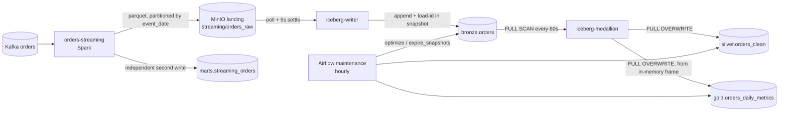
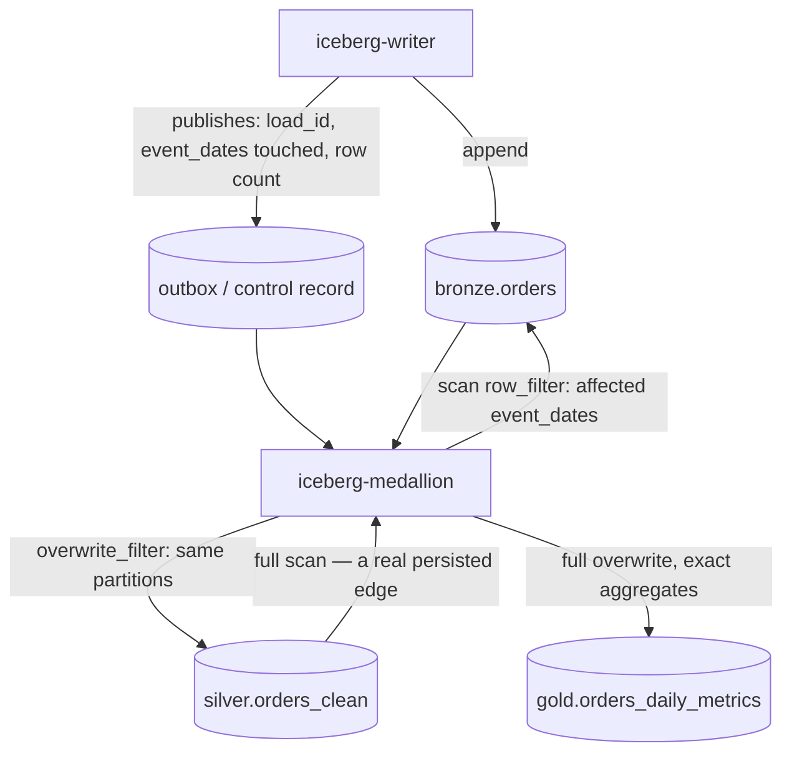
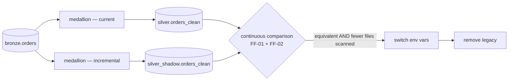

# ADR-0001 — Incremental Silver and Gold

| | |
|---|---|
| **Status** | **Proposed** — P-0 and D-4 decided, D-1 open and blocking D-3 |
| **Date** | 2026-08-08 |
| **Deciders** | *(unassigned)* |
| **Supersedes** | nothing — this is the repository's first ADR |
| **Evidence base** | [`docs/architecture-audit/baseline/`](../architecture-audit/baseline/README.md) — committed, frozen |

This is the first architecture decision record in this repository. Until now every architectural
rule in the system was reconstructed from prose in `docs/ARCHITECTURE.md`, and the audit that
produced this document had to record that fact as its own most durable finding: **zero ADRs, nine
declared rules, one prose source.** That is why conformance scoring is suppressed everywhere in
the audit, and why this document exists before any code changes.

---

## P-0 — Foundational decision: the domain model needs a single authoritative source

**This decision sits above all four that follow, and it is not about which domain model is
correct. It is about the fact that there is currently no way to answer that question.**

Three artifacts in this repository answer *"what does a repeated `order_id` mean?"* and they
disagree:

| Artifact | Says | Evidence |
|---|---|---|
| `kafka/producer/orders_producer.py:59` | **Immutable event** — a fresh `uuid4` per event; no `order_id` ever recurs | `create_event()` |
| `tests/e2e/test_lakehouse_e2e.py:118` | **Mutable entity** — publishes one `order_id` twice with different `customer`, `amount`, `status`, and asserts the later wins | `build_fixture()`, asserted at `:1017` |
| `spark/jobs/orders_streaming.py:179` | **Mutable entity** — `order_id varchar primary key` with `on conflict (order_id) do update set customer, amount, country, status` | `marts.streaming_orders` DDL |

Two of three say mutable. The dissenting one is the one that generates the live data. The most
formal statement — a `PRIMARY KEY` with an `UPDATE` of business attributes — is a DDL-level
declaration that an order mutates, and nothing reconciles it with the generator.

### Decision

> **The domain model has exactly one authoritative source, and it is declared here in this ADR.
> Where the producer, the test fixtures and the database schema disagree, this document is
> normative and the artifacts are brought into line with it — not the other way round.**

### Why this is a decision and not a preamble

Without P-0 stated explicitly, the disagreement re-emerges as a technical argument that cannot be
settled on technical grounds. It already has: the audit's two phases assigned *different
severities to the same finding* (F-303) because each reasoned from a different domain assumption,
and both were correct within their own.

The observable consequence is predictable. In six months someone reopens the question as a debate
about `MERGE` semantics, without recognising that the disagreement is not about `MERGE` at all.

### Consequences

- Every domain-semantic claim in code, tests or DDL must be traceable to this ADR or to a
  successor.
- Changing the generator's emission semantics becomes an **architectural** change requiring an ADR
  amendment, not a fixture tweak.
- The three artifacts above are, as of this document, **known to be inconsistent**. Closing D-1
  requires changing at least one of them.

---

## 1. Context

### What exists



### The constraints that actually bind

Not a wish-list. Each is a verified property of the system as it stands.

| ID | Constraint | Location |
|---|---|---|
| **F-701** | **Bronze has no row-level provenance.** Ten columns, none recording when or by which load a row arrived. `kafka_offset` is per-partition monotonic; `kafka_timestamp` is an event clock. **No column exists on which a watermark could be built.** | `iceberg_writer.py:56-67` |
| **F-704** | **The pinned pyiceberg 0.11.1 has no incremental scan.** `Table` exposes only `append` and `scan`; `scan(snapshot_id=…)` is time travel, not a delta. `overwrite(overwrite_filter=…)` *is* available. | `iceberg/Dockerfile:3`, API introspection |
| **F-301** | **Bronze snapshot history has two owners.** It is the writer's idempotency ledger *and* the maintenance DAG expires it hourly at a 1h threshold. No rule reconciles retention with recovery. | `iceberg_writer.py:207`, `lakehouse_maintenance.py:111` |
| **F-302** | **The silver→gold edge does not exist.** `build_gold(silver_df)` reads the in-memory frame. Gold is unpartitioned (`PartitionSpec()`). Its aggregates are `count_distinct` and `mean`. | `iceberg_medallion.py:290, 291, 196` |
| **F-303** | **`Table.upsert` cannot express AR-004.** `when_matched_update_all` takes no predicate, so a lower `kafka_offset` overwrites a higher one. No identifier fields exist. The match key is uncorrelated with the partition spec, so no pruning. | `iceberg_medallion.py:53, 66`, pyiceberg 0.11.1 |
| **F-702** | **Every event lands in one partition.** `event_time = now()` → `event_date` = today → the changed-partition set is always a single partition holding the whole working set. | `orders_producer.py:64` |
| **F-703** | **Landing→Bronze has no commit contract.** A five-second mtime heuristic stands in for Spark's `_spark_metadata`; the `/_temporary/` guard is aimed at the batch committer, not the streaming one. | `iceberg_writer.py:113-144` |
| **F-708** | **Partition-scoped dedup is correct only while `order_id` → `event_date` is functionally determined.** True today only because the generator never repeats an order. Unstated, untested. | `orders_producer.py:59` |
| **F-1005/1006** | **No live-stack test blocks a PR** (`ci-integration` triggers on push to `main`), and **every fixture is single-partition**. | workflows, `test_lakehouse_e2e.py:77` |

### The thing that makes this hard

The audit's central finding, confirmed and widened across three phases:

> **Full overwrite is not a performance choice. It is the mechanism that substitutes for progress
> state — and for the ordering semantics of AR-004, and for the missing silver→gold edge. It is
> additionally repairing duplicate rows in Bronze on every cycle.**

Falsification was attempted and failed: `bronze.scan().to_arrow()` at `iceberg_medallion.py:257`
is unfiltered and unordered, and nothing crosses between cycles. The rebuild is a pure function of
the full Bronze state.

**The principal risk is treating this as one change.** It is three reconstructions that happen to
share a trigger.

---

## 2. Evidence

**This ADR is self-sufficient.** Every constraint in §1 and every argument below carries a
`file:line` reference into this repository, and each can be checked by reading the code. Nothing
here requires the reader to open the audit.

The audit baseline is committed at
[`docs/architecture-audit/baseline/`](../architecture-audit/baseline/README.md) for a different
purpose: it is the frozen reference a later `verify-architecture-remediation` run compares
against, and it records what the audit examined, what it skipped, and what it never observed.

| Artifact | Purpose | sha256 |
|---|---|---|
| `baseline/synthesis/architecture-findings.json` | 28 findings with full evidence chains | `8417535f73fc2a34…` |
| `baseline/synthesis/synthesis.md` | The verdict and its reasoning | `b896fb5540f49957…` |
| `baseline/synthesis/rejected-or-deferred-findings.md` | What was challenged, deferred, and what would overturn it | `9d47c9751de69866…` |
| `baseline/synthesis/coverage.md` | Scope, method, and everything not observed | `628c1dd9dd13e053…` |

Digests are **traceability, not a precondition for understanding this document.** Intermediate
audit artifacts — inventory, intent profile, per-specialist findings — are local working state and
are deliberately not committed; their digests are recorded inside `architecture-findings.json` so
drift can be detected if they are ever regenerated.

### What the evidence does *not* cover

Stated so this ADR can be attacked rather than merely believed.

- **No live stack was started in any phase.** No orphan landing file, commit conflict, duplicate
  append or concurrency window was ever reproduced. F-703's confidence is `medium` for exactly
  this reason.
- **Five specialist audits were deliberately not run** — clean/hexagonal, modularity & SOLID, DDD,
  security, quality attributes. Absence of a finding is not evidence of absence.
- **The largest unexamined alternative is a runtime change.** Moving the medallion to Spark or
  Trino would give engine-native change tracking and make F-701, F-704 and much of D-2 irrelevant.
  It was out of scope because the profile fixed the medallion as a pyiceberg process. **It was
  never evaluated.**

---

## 3. Decisions

### D-1 — Domain model · **OPEN, blocking D-3**

> Is `order_id` an immutable event identifier, or a mutable business entity key?

| | **A · Immutable event** | **B · Mutable business entity** |
|---|---|---|
| A repeat is | a replay | an order update |
| AR-004 is | transport-level duplicate defence | a business projection rule |
| F-303 | largely dissolves — a replay carries identical values | **becomes a blocker** |
| F-708 invariant | holds by construction | cannot be assumed; orders cross partitions |
| Silver is | a derived view | a stateful business projection |
| Natural execution model | changed-partition rebuild (C) | business-key approaches (B) |
| Must change | the e2e fixture's naming | **the generator** |

**Status: undecided.** The evidence is 2:1 for B; the dissenting artifact is the live data source.
This ADR does not resolve it because resolving it is a product decision about what the platform
teaches, not an inference from the code.

**It must be closed before D-3.** Nothing else in this document is blocked by it.

#### D-1-R1 — the ordering contract that B requires (derived rule)

If D-1 resolves to **B**, `kafka_offset` becomes a *version* number, and AR-004 —
"highest `kafka_offset` wins" — becomes a business rule rather than replay defence. That rule is
only meaningful if all versions of one order are comparable, and **Kafka offsets are monotonic
only within a partition.** Comparing offsets across partitions is meaningless.

The comparison is sound today, but **not** because the topic has a single partition:

- **The producer already keys by `order_id`** — `producer.produce(topic, key=event["order_id"].encode("utf-8"), …)`
  at `orders_producer.py:92`. The default partitioner therefore routes every version of an order
  to the same partition **at any partition count**. The required behaviour is already implemented.
- **It is nowhere declared, tested, or protected.** No test asserts the key is set; removing it
  would still produce a working pipeline whose ordering rule is silently wrong.
- **The single partition is a broker default, not a decision.** No `KAFKA_NUM_PARTITIONS` is set
  in `docker-compose.extended.yml`; the `orders` topic is auto-created. The e2e suite creates its
  own topic explicitly with `--partitions 1` (`test_lakehouse_e2e.py:316`) — the only place a
  partition count is written down anywhere, and it is test-only.

The residual risk is therefore **not** multi-partition operation. It is a **change in partition
count**: Kafka's partitioner is `hash(key) % partitions`, so increasing the count remaps existing
keys. An order whose versions straddle that change lands in two partitions, and its version
ordering becomes undefined. Nothing would report an error.

**Decision, if D-1 resolves to B:**

> All versions of a given `order_id` MUST be routed to the same Kafka partition, using `order_id`
> as the message key. The topic's partition count is part of the ordering contract and MUST NOT
> be changed while `kafka_offset` is used as the version comparator.

**Guard:** assert the producer sets the key (unit, PR tier — cheap), and assert no `order_id`
appears under two `kafka_partition` values in Bronze (integration, alongside FF-09 which has the
same shape for `event_date`).

**Alternative worth weighing:** carry an explicit business version or event sequence in the
payload instead. That removes the dependency on transport metadata entirely, and it is the more
honest model if orders genuinely have a lifecycle — but it changes the event contract and all
three schema declarations (F-706), so it is a larger change than it looks.

Under D-1-A this rule is unnecessary: there are no versions to order.

### D-2 — Progress ownership · **OPEN**

> Bronze snapshot ids, Kafka offsets, a control table, or a writer-published outbox?

**Eliminated on evidence:**

- **Kafka offsets** — per-partition monotonic only, and two hops behind by the time data reaches
  Bronze. Not a global watermark.
- **A row-level watermark on existing Bronze columns** — F-701: no such column exists.

**Viable, with their real costs:**

| Option | Cost |
|---|---|
| Bronze snapshot ids | Inherits F-301's retention dependency **and** F-704's missing API; requires hand-rolled manifest diffing on library internals |
| Medallion control table | Depends on nothing the medallion does not own — but `marts` has five DDL owners, three issuing runtime DDL, one of them a student exercise, all on one credential (F-305) |
| **Writer-published outbox** | The writer already holds the delta in memory at append time |

**Recommendation: the writer-published outbox.** It is the only option that *removes* a
cross-component ownership conflict instead of adding one, and it takes F-301 off the medallion's
critical path entirely. This is an argument from ownership, not from performance.

**Binding constraint on whatever is chosen:** it must be **atomically written and bounded**. The
one existing precedent — the writer's `done` set, serialised in full through a truncating write on
every load (F-707) — is neither, and must not be copied.

### D-3 — Silver execution model · **OPEN, depends on D-1 and D-2**

**Recommendation: option F** (see §4), *conditional on D-1 resolving to A*.

Its principal merit is **not** performance:

> The rebuild of a changed scope remains **deterministic and idempotent** — the same property that
> makes the current full overwrite correct.

Under D-1-B this recommendation is withdrawn and option B becomes competitive.

### D-4 — Gold execution model · **DECIDED**

> **Gold is not made incremental. It is rebuilt in full from persisted Silver on every cycle.**

| Reason | Detail |
|---|---|
| Non-composable aggregates | `count_distinct` and `mean` do not compose from a delta |
| Scale | One row per `event_date × country × status` — tens of rows |
| The missing edge | The silver→gold read must be created regardless; a full rebuild creates it as a side effect |
| Physical layout | Gold is unpartitioned, so any scoped rewrite rewrites the whole table anyway |
| Machinery cost | Incremental would need HLL-style sketch state to guard tens of rows |
| **Verifiability** | **A full rebuild is exactly verifiable. An incremental aggregate with sketches is only approximately verifiable.** |

Recorded explicitly because *"incremental Silver **and** Gold"* is the intuitive framing and the
evidence contradicts it. The phase is more accurately:

```text
Scoped-rebuild Silver  +  Persisted Silver → deterministic full Gold rebuild
```

### PREREQ-1 — Bronze commit contract · **not a decision**

F-703 is a missing contract, not a design choice. It exists independently of everything above and
would remain after any option ships. It concerns whether Bronze is a trustworthy log at all.

**Two claims here have different evidential standing, and they are ratified separately:**

| | Standing |
|---|---|
| **The decision** — introduce a real commit-boundary contract for Landing → Bronze, replacing the five-second mtime heuristic | ✅ **Ratified.** The contract is absent regardless of whether its absence has ever produced a failure. A time-based guess standing in for a commit is not defensible in a design, and the `/_temporary/` guard demonstrably targets the wrong protocol. |
| **The claim** — the existing heuristic has caused, or is likely to cause, observable duplicate or orphan ingestion | ⚠️ **Not ratified.** F-703 carries `confidence: medium`. It was never reproduced; no live stack was started, no orphan file was found. Spark's file-sink semantics are documented behaviour, not measurement. |

We are fixing a **missing correctness contract**. We are **not** asserting an observed production
failure. Conflating the two would overstate the evidence and weaken every other claim in this
document by association.

**It proceeds in parallel.** Smallest form: extract eligibility from `list_new_files` into a pure
function — *given a listing and the set of committed paths, return the eligible files* — and test
it on the PR tier.

---

## 4. Alternatives considered

Six options were assessed against the pinned stack. Two are eliminated, one is not an alternative.

| | Available in 0.11.1 | Verdict |
|---|---|---|
| **A** · snapshot-delta + selective partition overwrite | **no** | **Eliminated.** Requires rebuilding an incremental scan from `inspect` metadata, on library internals, on top of snapshots F-301 lets maintenance delete. Highest machinery cost of the six. |
| **B** · business-key upsert | yes | **Live.** Immune to F-702; correct under D-1-B. But cannot express latest-offset-wins (F-303), needs explicit `join_cols` because no identifier fields exist, scans every partition, and requires a pre-deduplicated delta. |
| **C** · changed-partition rebuild | yes | **Live.** Uses only `scan(row_filter)` and `overwrite(overwrite_filter)`. **F-303 dissolves rather than needing mitigation.** Idempotent by construction. Rests on F-708's invariant; reduces no work until F-702 is fixed. |
| **D** · Silver changelog / CDC intermediate | yes | **Eliminated.** A fourth persisted layer and a fourth schema declaration in a system already failing to keep three in sync (F-706). No consumer needs row-level change events. |
| **E** · control / progress table | yes | **Not an alternative.** It is the missing component *every* other option needs. It is D-2. |
| **F** · writer outbox + changed-partition Silver + full Gold rebuild | yes | **Recommended, conditional on D-1-A.** Combines E with C; makes the silver→gold read real; removes F-301 from the medallion's critical path. Still requires F-702 and F-708 resolved. |

### The dependency that decides the ranking

**B and C fail in opposite conditions.**

- **C** is correct and cheap, but demonstrates nothing until F-702 is addressed — with one hot
  partition, a changed-partition rebuild performs exactly the work the full overwrite did.
- **B** is insensitive to F-702, but carries every constraint in F-303.

**If F-702 is not addressed, the ranking inverts.**

### F-702 is settled by a guard, not by a decision

`DataScan.plan_files()` makes files-per-cycle observable with no instrumentation. Write **FF-02**
first, then attempt to build a fixture that makes it pass. If none can exist, F-702 has answered
itself and either the generator or the partition grain must change.

This avoids both failure modes: choosing an architecture to fit an artificially simple generator,
and choosing a data shape to fit a preferred architecture.

---

## 5. Chosen architecture

**Partially decided. Recorded honestly rather than forced to completion.**

| Decision | Status |
|---|---|
| **P-0** Canonical domain model | ✅ **Decided** — this ADR is the single authoritative source |
| **D-1** Immutable vs mutable | ⛔ **Open — blocking D-3** |
| **D-2** Progress ownership | 🟡 **Recommended** (writer outbox), not ratified |
| **D-3** Silver execution model | ⛔ **Open** — recommendation conditional on D-1-A |
| **D-4** Gold execution model | ✅ **Decided** — full rebuild from persisted Silver |
| **PREREQ-1** Bronze commit contract | ✅ **Decided** — fix independently, in parallel |

### The target, if D-1 resolves to A



Read as a sequence:

```text
writer commit → explicit committed-batch record → identify affected scope
   → deterministic rebuild of that scope → persist Silver
   → full Gold rebuild from persisted Silver
```

**What this preserves, and why it is the point:** the rebuild of any scope stays a pure function
of Bronze. Re-running it is a no-op. That is precisely the property that makes today's full
overwrite correct, and it is the reason F-303 dissolves under this design rather than needing
mitigation.

**What remains open under D-1-B:** if orders genuinely mutate, `order_id` → `event_date` is no
longer functionally determined, partition-scoped dedup can emit one row per partition for a single
order, and a key-based model becomes the honest choice. **Do not implement the diagram above until
D-1 is closed.**

---

## 6. Migration strategy — shadow Silver

**The mechanism already exists and is unused.** Every medallion table identifier is an environment
variable — `SILVER_NAMESPACE`, `SILVER_TABLE`, `GOLD_NAMESPACE`, `GOLD_TABLE`
(`iceberg_medallion.py:35-42`), passed explicitly by the compose service. **A second medallion
writing to a shadow Silver needs no code change at all.**



1. **Run both.** Two medallion containers, same Bronze, different Silver/Gold targets. Both only
   read Bronze; neither writes it, so they cannot conflict.
2. **Compare continuously.** FF-01 (equivalence) and FF-02 (scan volume) run against **two live
   tables**, not two code paths in a test. Real data, accumulated over cycles, not a fixture.
3. **Switch** by changing two environment variables.
4. **Remove** the legacy path only after every exit criterion below is met.

This converts the riskiest change in the project from a speculation into an observation, and it is
simultaneously the cheapest possible implementation of FF-01.

### Exit criteria — all must hold before the switch

Stated as checks, not as a feeling. The numbers are adjustable; **replacing them with a judgement
call is not.**

| # | Criterion | Why this one |
|---|---|---|
| **X-1** | ≥ 50 consecutive cycles with **zero** row-level differences between `silver` and `silver_shadow`, compared against a **pinned Bronze snapshot** so both see identical input | FF-01 against real accumulated data rather than a fixture. Snapshot pinning is what makes the comparison non-racy while the writer keeps appending |
| **X-2** | `silver_shadow` plans **strictly fewer** data files than the full rebuild in ≥ 90% of cycles, measured by `DataScan.plan_files()` | FF-02. Not 100%: a cycle that legitimately touches every partition is allowed. **If this cannot be met, F-702 is unresolved and the change is incremental in name only** |
| **X-3** | The window spans **at least one `event_date` boundary** (local midnight) | The only condition under which more than one partition exists, and therefore the only way partition-scoped behaviour is exercised at all. Also the only way F-708's cross-partition case can occur |
| **X-4** | ≥ 1 unplanned or induced **restart of the shadow medallion** mid-cycle, recovering with no loss and no double-apply | FF-05 under production conditions rather than in a test harness |
| **X-5** | ≥ 1 **maintenance DAG run** completed during the window with the shadow medallion active | Exercises the F-307 concurrency window between `optimize` / `expire_snapshots` and the medallion's commit — the one interaction no test covers |
| **X-6** | Gold rebuilt from **persisted** `silver_shadow` matches Gold rebuilt from `silver`, exactly | FF-06 and D-4. Exact, not approximate — that is the whole argument for a full Gold rebuild |

**If X-2 fails, do not proceed and do not weaken the criterion.** It is the only evidence that the
change achieved anything, and F-702 predicts it will fail until the partition dimension is real.

**X-3 and X-5 are time-bound, not cycle-bound.** With a 60-second cycle and an hourly maintenance
schedule, the window is at least ~24 hours regardless of how quickly X-1 accumulates.

**Table migrations required regardless of D-3's outcome:**

- **Gold partitioning** — currently `PartitionSpec()`. Needed only if Gold ever becomes scoped;
  under D-4 it does not, so this is deferred rather than required.
- **Bronze provenance column** — needed only if D-2 resolves to a row-level marker rather than the
  outbox. Additive, but requires deciding whether existing rows are backfilled or treated as
  pre-epoch.

---

## 7. Fitness functions

Architecture rules in this system are currently **not executable**: 60 tests, all behavioural, not
one asserting ownership, direction, retention, ordering or work volume. Import-plane guards are
unavailable — the single internal import edge is built by runtime `sys.path` mutation and no static
tool resolves it (F-306).

Every guard below is therefore stated against the **data plane**.

| ID | Rule | Statement | Tier | Guards | Domain |
|---|---|---|---|---|---|
| **FF-01** | `TE-FF-EQUIV` | Incremental Silver equals full-rebuild Silver over the same Bronze snapshot | Integration | QAS-001, F-302 | both |
| **FF-02** | `TE-FF-SCAN` | An incremental cycle plans strictly fewer data files than a full rebuild | Integration | F-702, F-1002 | both |
| **FF-03** | `TE-FF-IDEM` | Re-applying the same committed batch leaves Silver unchanged | Integration | F-301, F-703 | both |
| **FF-04** | `TE-FF-ORDER` | A lower `kafka_offset` never overwrites an applied higher one | Integration | F-303 | **D-1-B only** |
| **FF-05** | `TE-FF-RECOVER` | A crash before or after the Silver commit recovers with no loss and no double-apply | Integration | F-1004 | both |
| **FF-06** | `TE-FF-PERSIST` | Gold is built from persisted Silver, not an in-memory frame | Integration | F-302 | both |
| **FF-07** | `TE-FF-COMMIT` | Only files committed per Spark's streaming metadata are eligible for Bronze | **PR** + integration | F-703 | both |
| **FF-08** | `TE-FF-SCHEMA` | The three order-schema declarations agree on names, order and nullability | **PR** | F-706 | both |
| **FF-09** | `TE-FF-INVARIANT` | No `order_id` spans two `event_date` partitions in Bronze | Integration | F-708 | both |
| **FF-10** | `TE-FF-RETENTION` | `MAINTENANCE_RETENTION` exceeds the maximum writer recovery window | **PR** | F-301 | both |
| **FF-11** | `TE-FF-ATOMIC` | A crash mid-state-write never yields a truncated state file | **PR** | F-707 | both |
| **FF-12** | `TE-FF-RECONCILE` | Produced events equal landed rows plus dead-lettered rows | Integration | F-705 | both |
| **FF-13** | `TE-FF-ORDERING-CONTRACT` | The transport ordering contract holds: the producer keys by `order_id`, **and** the topic partition count equals the declared architectural value | **PR** + integration | D-1-R1 | **D-1-B only** |

### Three notes that matter more than the table

**FF-01 is only testable because time travel exists.** `Table.scan(snapshot_id=…)` is available in
0.11.1 even though a delta scan is not (F-704). Pin the snapshot and both paths see identical input
despite a continuously appending writer. Without it the test would be inherently racy.

**FF-04 cannot be built from publication order.** Kafka assigns offsets in publication order, so the
winning version always arrives last — which is why the existing e2e assertion passes and *cannot*
catch F-303. The regression is reachable only by **replay**: re-appending an older landing file to
Bronze. And it is vacuous under D-1-A, where a replayed duplicate carries identical values.

**FF-05 needs a seam that does not exist.** The writer has two crash hooks and a real fault-injection
suite; the medallion has neither, and its tests are entirely mocked. The change makes the medallion
stateful. **Add `SIMULATE_CRASH_BEFORE_SILVER_COMMIT` / `_AFTER_` before writing the progress logic,
not after.** `tests/integration/test_crash_recovery.py` is the template.

**FF-13 guards a contract that Kafka will let you break silently.** Increasing a topic's partition
count is a routine, permitted operation with no warning — and under D-1-B it is a **semantics-breaking
change**, because `hash(key) % partitions` remaps existing keys and an order whose versions straddle
the change loses its ordering. Three parts, and all three are needed:

1. the producer MUST key records by `order_id` — unit assertion, cheap;
2. the topic partition count MUST equal the declared architectural value — asserted against the live
   broker;
3. CI MUST fail if either changes.

This is a good illustration of why §7 is stated against the data plane: no import-level architecture
tool could ever see this rule, and the property it protects lives entirely in broker configuration
and one line of producer code.

### Enforcement prerequisite

`ci-integration` triggers on `workflow_dispatch` and **push to `main`** — after the merge. As things
stand, every guard above except FF-07's unit half and the PR-tier ones would run only post-merge.
Add `pull_request`, path-scoped to `iceberg/**`, `spark/**`, `dags/**`, `tests/integration/**`.

### Fixture prerequisite

Every fixture in the repository is single-partition. FF-02 and FF-09 cannot be written until the
e2e fixture spreads across at least three `event_date` values, with one order whose two versions
fall on different dates so FF-09 has a fixture that could violate it.

---

## 8. Rollback

Rollback is close to free, and that is a direct consequence of §6 rather than a separate design.

| Stage | Rollback | Cost |
|---|---|---|
| Shadow running | Stop the shadow container | Zero — the live path was never touched |
| After switch | Revert two environment variables | Seconds; the legacy Silver still exists and is still being written |
| After legacy removal | Re-enable the full-overwrite medallion; it rebuilds Silver and Gold from Bronze in one cycle | One cycle — **because the full rebuild is a pure function of Bronze** |

The last row is worth stating plainly: **the property this change is removing is also the property
that makes rolling it back trivial.** That asymmetry is temporary. Once the legacy path is deleted
and Bronze retention has moved on, it is gone.

**Therefore: do not delete the legacy medallion path in the same change that ships the incremental
one.** Keep it behind the environment seam until FF-01 and FF-02 have been green across a
meaningful window.

### Irreversible steps, flagged

- **A Bronze schema change** (if D-2 takes the row-level route) is additive but not reversible
  without a table rewrite.
- **Gold repartitioning** is a table migration. Under D-4 it is not required.
- **Deleting the legacy medallion** removes the free rollback described above.

---

## Open questions

1. **D-1** — immutable event or mutable business entity? *Blocks D-3. Product decision.*
   1a. **If B: `kafka_offset` or an explicit `business_version`?** Reusing `kafka_offset` as the
   version comparator makes a transport detail into a hidden domain field, and buys the ordering
   contract D-1-R1 and FF-13 have to defend. An explicit version in the payload removes that
   dependency entirely and is the more honest model for a real lifecycle — at the cost of changing
   the event contract and all three schema declarations (F-706). **This ADR now makes that
   trade-off available as a conscious choice rather than an inherited default.**
2. **D-2** — outbox, control table, or snapshot ids? *Recommendation stands; not ratified.*
3. **F-702** — is the demonstration goal correctness, or work reduction? *Settled empirically by
   FF-02, not by discussion.*
4. **The unexamined alternative** — should the medallion move to Spark or Trino? Engine-native
   change tracking would make F-701 and F-704 irrelevant. Never evaluated; out of the audit's
   scope.

---

## Next step

`plan-architecture-remediation`, once P-0 is ratified and D-1 is closed. Decomposing work items
before then would produce tasks for two mutually exclusive projects: D-1-A yields replay handling,
provenance, partition rebuild and scan optimisation; D-1-B yields update semantics, ordering
guarantees, version-conflict policy and lifecycle modelling.

**PREREQ-1, FF-07, FF-08, FF-10 and FF-11 do not depend on any open decision and can start now.**
