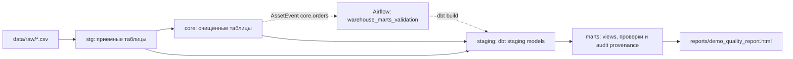

# Demo schema

Эта схема показывает главный смысл demo: из CSV-файлов появляются staging-таблицы, потом core-слой, потом витрины и проверки качества.

## Поток данных

## Слои

`data/raw`

Исходные CSV-файлы:

- `olist_orders_dataset.csv`
- `olist_order_items_dataset.csv`
- `olist_order_payments_dataset.csv`
- `olist_customers_dataset.csv`

`stg`

Технический слой загрузки. Структура близка к CSV, добавлен `ingest_date`.

- `stg.orders`
- `stg.order_items`
- `stg.order_payments`
- `stg.customers`

`core`

Очищенный слой для дальнейших расчетов.

- `core.orders`
- `core.order_items`

`staging`

Слой dbt. Тонкая проекция колонок над `stg` и `core`: ни join, ни агрегатов.
Единственное место, где dbt-модель обращается к сырому отношению через
`source()`.

- `staging.stg_core__orders`
- `staging.stg_core__order_items`
- `staging.stg_staging__orders`
- `staging.stg_staging__order_items`

`marts`

Витрины и smoke-аудит.

- `marts.v_order_items_wide`
- `marts.v_sales_daily`
- `marts.v_customer_state_daily`
- `marts.v_reconcile_sales_daily`
- `marts.v_smoke_last_run`
- `marts.pipeline_runs`

`marts.pipeline_runs.run_id` остается primary key downstream DagRun. Nullable
`ingestion_run_id` хранит исходный manual ingestion DagRun и имеет обычный
неуникальный индекс `idx_pipeline_runs_ingestion_run_id`; исторические строки
совместимы через `NULL`.

Важно: объекты `marts.v_*` и `staging.stg_*` являются view. В dbdiagram.io они
описаны как `Table`, потому что DBML так удобнее рисует структуру.

Владение: `db/init/` создаёт схемы, таблицы `stg.*` и `core.*` и audit-объекты.
Четыре витрины `marts.v_*` и четыре модели `staging.stg_*` определены в
`dbt/warehouse` и появляются только после `dbt build` — на свежей базе их ещё
нет. Правило слоёв описано в
[W4 — dbt architecture gate](warehouse/W4-dbt-architecture-gate.md).

## Как построить диаграмму в dbdiagram.io

1. Открой https://dbdiagram.io/.
2. Создай новую диаграмму.
3. Для обзорной диаграммы скопируй содержимое [dbdiagram_overview.dbml](dbdiagram_overview.dbml) в левый редактор.
4. Для полного справочника объектов используй [dbdiagram_demo.dbml](dbdiagram_demo.dbml).
5. Разложи блоки по слоям: `stg` слева, `core` и `staging` по центру, `marts` справа.

Для обзорной диаграммы лучше использовать короткий DBML. Главный визуальный смысл: `raw CSV -> stg -> core -> staging -> marts`, а не полный справочник колонок.
